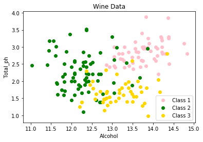
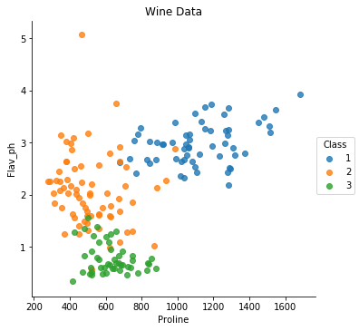

```python
import pandas as pd
import numpy as np
import scipy.io
import matplotlib
import matplotlib.pylab as plt
import random

from sklearn import cross_validation
from sklearn.grid_search import GridSearchCV
from sklearn.discriminant_analysis import LinearDiscriminantAnalysis

from sklearn.model_selection import train_test_split
from sklearn.metrics import classification_report, confusion_matrix
from sklearn.preprocessing import StandardScaler

# To model the decision tree 
from sklearn.tree import DecisionTreeClassifier
# To model the Gaussian Navie Bayes classifier
from sklearn.naive_bayes import GaussianNB
# To model the KNeighborsClassifier
from sklearn.neighbors import KNeighborsClassifier

import seaborn as sns
```

    /anaconda2/envs/py36/lib/python3.6/site-packages/sklearn/cross_validation.py:41: DeprecationWarning: This module was deprecated in version 0.18 in favor of the model_selection module into which all the refactored classes and functions are moved. Also note that the interface of the new CV iterators are different from that of this module. This module will be removed in 0.20.
      "This module will be removed in 0.20.", DeprecationWarning)
    /anaconda2/envs/py36/lib/python3.6/site-packages/sklearn/grid_search.py:42: DeprecationWarning: This module was deprecated in version 0.18 in favor of the model_selection module into which all the refactored classes and functions are moved. This module will be removed in 0.20.
      DeprecationWarning)


```python
filename = "/Users/Wine.txt"
columns = ["Class","Alcohol","Malic_acid","Ash","Alcal_ash",
           "Mag","Total_ph","Flav_ph","Nonflav_ph","Proan", 
           "Color_inten","Hue","Diluted", "Proline"]
winedata = pd.read_csv(filename, header = None, sep=',',names = columns)
```


```python
winedata.shape
```


    (178, 14)


```python
winedata.head()
```


<div>
<style scoped>
    .dataframe tbody tr th:only-of-type {
        vertical-align: middle;
    }

    .dataframe tbody tr th {
        vertical-align: top;
    }

    .dataframe thead th {
        text-align: right;
    }
</style>
<table border="1" class="dataframe">
  <thead>
    <tr style="text-align: right;">
      <th></th>
      <th>Class</th>
      <th>Alcohol</th>
      <th>Malic_acid</th>
      <th>Ash</th>
      <th>Alcal_ash</th>
      <th>Mag</th>
      <th>Total_ph</th>
      <th>Flav_ph</th>
      <th>Nonflav_ph</th>
      <th>Proan</th>
      <th>Color_inten</th>
      <th>Hue</th>
      <th>Diluted</th>
      <th>Proline</th>
    </tr>
  </thead>
  <tbody>
    <tr>
      <th>0</th>
      <td>1</td>
      <td>14.23</td>
      <td>1.71</td>
      <td>2.43</td>
      <td>15.6</td>
      <td>127</td>
      <td>2.80</td>
      <td>3.06</td>
      <td>0.28</td>
      <td>2.29</td>
      <td>5.64</td>
      <td>1.04</td>
      <td>3.92</td>
      <td>1065</td>
    </tr>
    <tr>
      <th>1</th>
      <td>1</td>
      <td>13.20</td>
      <td>1.78</td>
      <td>2.14</td>
      <td>11.2</td>
      <td>100</td>
      <td>2.65</td>
      <td>2.76</td>
      <td>0.26</td>
      <td>1.28</td>
      <td>4.38</td>
      <td>1.05</td>
      <td>3.40</td>
      <td>1050</td>
    </tr>
    <tr>
      <th>2</th>
      <td>1</td>
      <td>13.16</td>
      <td>2.36</td>
      <td>2.67</td>
      <td>18.6</td>
      <td>101</td>
      <td>2.80</td>
      <td>3.24</td>
      <td>0.30</td>
      <td>2.81</td>
      <td>5.68</td>
      <td>1.03</td>
      <td>3.17</td>
      <td>1185</td>
    </tr>
    <tr>
      <th>3</th>
      <td>1</td>
      <td>14.37</td>
      <td>1.95</td>
      <td>2.50</td>
      <td>16.8</td>
      <td>113</td>
      <td>3.85</td>
      <td>3.49</td>
      <td>0.24</td>
      <td>2.18</td>
      <td>7.80</td>
      <td>0.86</td>
      <td>3.45</td>
      <td>1480</td>
    </tr>
    <tr>
      <th>4</th>
      <td>1</td>
      <td>13.24</td>
      <td>2.59</td>
      <td>2.87</td>
      <td>21.0</td>
      <td>118</td>
      <td>2.80</td>
      <td>2.69</td>
      <td>0.39</td>
      <td>1.82</td>
      <td>4.32</td>
      <td>1.04</td>
      <td>2.93</td>
      <td>735</td>
    </tr>
  </tbody>
</table>
</div>


```python
y = winedata['Class']
X = winedata.loc[:, 'Alcohol':]
```


```python
targetnames = X.columns
```


```python
winedata.describe()
```


<div>
<style>
    .dataframe thead tr:only-child th {
        text-align: right;
    }

    .dataframe thead th {
        text-align: left;
    }

    .dataframe tbody tr th {
        vertical-align: top;
    }
</style>
<table border="1" class="dataframe">
  <thead>
    <tr style="text-align: right;">
      <th></th>
      <th>Class</th>
      <th>Alcohol</th>
      <th>Malic_acid</th>
      <th>Ash</th>
      <th>Alcal_ash</th>
      <th>Mag</th>
      <th>Total_ph</th>
      <th>Flav_ph</th>
      <th>Nonflav_ph</th>
      <th>Proan</th>
      <th>Color_inten</th>
      <th>Hue</th>
      <th>Diluted</th>
      <th>Proline</th>
    </tr>
  </thead>
  <tbody>
    <tr>
      <th>count</th>
      <td>178.000000</td>
      <td>178.000000</td>
      <td>178.000000</td>
      <td>178.000000</td>
      <td>178.000000</td>
      <td>178.000000</td>
      <td>178.000000</td>
      <td>178.000000</td>
      <td>178.000000</td>
      <td>178.000000</td>
      <td>178.000000</td>
      <td>178.000000</td>
      <td>178.000000</td>
      <td>178.000000</td>
    </tr>
    <tr>
      <th>mean</th>
      <td>1.938202</td>
      <td>13.000618</td>
      <td>2.336348</td>
      <td>2.366517</td>
      <td>19.494944</td>
      <td>99.741573</td>
      <td>2.295112</td>
      <td>2.029270</td>
      <td>0.361854</td>
      <td>1.590899</td>
      <td>5.058090</td>
      <td>0.957449</td>
      <td>2.611685</td>
      <td>746.893258</td>
    </tr>
    <tr>
      <th>std</th>
      <td>0.775035</td>
      <td>0.811827</td>
      <td>1.117146</td>
      <td>0.274344</td>
      <td>3.339564</td>
      <td>14.282484</td>
      <td>0.625851</td>
      <td>0.998859</td>
      <td>0.124453</td>
      <td>0.572359</td>
      <td>2.318286</td>
      <td>0.228572</td>
      <td>0.709990</td>
      <td>314.907474</td>
    </tr>
    <tr>
      <th>min</th>
      <td>1.000000</td>
      <td>11.030000</td>
      <td>0.740000</td>
      <td>1.360000</td>
      <td>10.600000</td>
      <td>70.000000</td>
      <td>0.980000</td>
      <td>0.340000</td>
      <td>0.130000</td>
      <td>0.410000</td>
      <td>1.280000</td>
      <td>0.480000</td>
      <td>1.270000</td>
      <td>278.000000</td>
    </tr>
    <tr>
      <th>25%</th>
      <td>1.000000</td>
      <td>12.362500</td>
      <td>1.602500</td>
      <td>2.210000</td>
      <td>17.200000</td>
      <td>88.000000</td>
      <td>1.742500</td>
      <td>1.205000</td>
      <td>0.270000</td>
      <td>1.250000</td>
      <td>3.220000</td>
      <td>0.782500</td>
      <td>1.937500</td>
      <td>500.500000</td>
    </tr>
    <tr>
      <th>50%</th>
      <td>2.000000</td>
      <td>13.050000</td>
      <td>1.865000</td>
      <td>2.360000</td>
      <td>19.500000</td>
      <td>98.000000</td>
      <td>2.355000</td>
      <td>2.135000</td>
      <td>0.340000</td>
      <td>1.555000</td>
      <td>4.690000</td>
      <td>0.965000</td>
      <td>2.780000</td>
      <td>673.500000</td>
    </tr>
    <tr>
      <th>75%</th>
      <td>3.000000</td>
      <td>13.677500</td>
      <td>3.082500</td>
      <td>2.557500</td>
      <td>21.500000</td>
      <td>107.000000</td>
      <td>2.800000</td>
      <td>2.875000</td>
      <td>0.437500</td>
      <td>1.950000</td>
      <td>6.200000</td>
      <td>1.120000</td>
      <td>3.170000</td>
      <td>985.000000</td>
    </tr>
    <tr>
      <th>max</th>
      <td>3.000000</td>
      <td>14.830000</td>
      <td>5.800000</td>
      <td>3.230000</td>
      <td>30.000000</td>
      <td>162.000000</td>
      <td>3.880000</td>
      <td>5.080000</td>
      <td>0.660000</td>
      <td>3.580000</td>
      <td>13.000000</td>
      <td>1.710000</td>
      <td>4.000000</td>
      <td>1680.000000</td>
    </tr>
  </tbody>
</table>
</div>


```python
y.value_counts()
```


    2    71
    1    59
    3    48
    Name: Class, dtype: int64


```python
winedata.corr()
```


<div>
<style>
    .dataframe thead tr:only-child th {
        text-align: right;
    }

    .dataframe thead th {
        text-align: left;
    }

    .dataframe tbody tr th {
        vertical-align: top;
    }
</style>
<table border="1" class="dataframe">
  <thead>
    <tr style="text-align: right;">
      <th></th>
      <th>Class</th>
      <th>Alcohol</th>
      <th>Malic_acid</th>
      <th>Ash</th>
      <th>Alcal_ash</th>
      <th>Mag</th>
      <th>Total_ph</th>
      <th>Flav_ph</th>
      <th>Nonflav_ph</th>
      <th>Proan</th>
      <th>Color_inten</th>
      <th>Hue</th>
      <th>Diluted</th>
      <th>Proline</th>
    </tr>
  </thead>
  <tbody>
    <tr>
      <th>Class</th>
      <td>1.000000</td>
      <td>-0.328222</td>
      <td>0.437776</td>
      <td>-0.049643</td>
      <td>0.517859</td>
      <td>-0.209179</td>
      <td>-0.719163</td>
      <td>-0.847498</td>
      <td>0.489109</td>
      <td>-0.499130</td>
      <td>0.265668</td>
      <td>-0.617369</td>
      <td>-0.788230</td>
      <td>-0.633717</td>
    </tr>
    <tr>
      <th>Alcohol</th>
      <td>-0.328222</td>
      <td>1.000000</td>
      <td>0.094397</td>
      <td>0.211545</td>
      <td>-0.310235</td>
      <td>0.270798</td>
      <td>0.289101</td>
      <td>0.236815</td>
      <td>-0.155929</td>
      <td>0.136698</td>
      <td>0.546364</td>
      <td>-0.071747</td>
      <td>0.072343</td>
      <td>0.643720</td>
    </tr>
    <tr>
      <th>Malic_acid</th>
      <td>0.437776</td>
      <td>0.094397</td>
      <td>1.000000</td>
      <td>0.164045</td>
      <td>0.288500</td>
      <td>-0.054575</td>
      <td>-0.335167</td>
      <td>-0.411007</td>
      <td>0.292977</td>
      <td>-0.220746</td>
      <td>0.248985</td>
      <td>-0.561296</td>
      <td>-0.368710</td>
      <td>-0.192011</td>
    </tr>
    <tr>
      <th>Ash</th>
      <td>-0.049643</td>
      <td>0.211545</td>
      <td>0.164045</td>
      <td>1.000000</td>
      <td>0.443367</td>
      <td>0.286587</td>
      <td>0.128980</td>
      <td>0.115077</td>
      <td>0.186230</td>
      <td>0.009652</td>
      <td>0.258887</td>
      <td>-0.074667</td>
      <td>0.003911</td>
      <td>0.223626</td>
    </tr>
    <tr>
      <th>Alcal_ash</th>
      <td>0.517859</td>
      <td>-0.310235</td>
      <td>0.288500</td>
      <td>0.443367</td>
      <td>1.000000</td>
      <td>-0.083333</td>
      <td>-0.321113</td>
      <td>-0.351370</td>
      <td>0.361922</td>
      <td>-0.197327</td>
      <td>0.018732</td>
      <td>-0.273955</td>
      <td>-0.276769</td>
      <td>-0.440597</td>
    </tr>
    <tr>
      <th>Mag</th>
      <td>-0.209179</td>
      <td>0.270798</td>
      <td>-0.054575</td>
      <td>0.286587</td>
      <td>-0.083333</td>
      <td>1.000000</td>
      <td>0.214401</td>
      <td>0.195784</td>
      <td>-0.256294</td>
      <td>0.236441</td>
      <td>0.199950</td>
      <td>0.055398</td>
      <td>0.066004</td>
      <td>0.393351</td>
    </tr>
    <tr>
      <th>Total_ph</th>
      <td>-0.719163</td>
      <td>0.289101</td>
      <td>-0.335167</td>
      <td>0.128980</td>
      <td>-0.321113</td>
      <td>0.214401</td>
      <td>1.000000</td>
      <td>0.864564</td>
      <td>-0.449935</td>
      <td>0.612413</td>
      <td>-0.055136</td>
      <td>0.433681</td>
      <td>0.699949</td>
      <td>0.498115</td>
    </tr>
    <tr>
      <th>Flav_ph</th>
      <td>-0.847498</td>
      <td>0.236815</td>
      <td>-0.411007</td>
      <td>0.115077</td>
      <td>-0.351370</td>
      <td>0.195784</td>
      <td>0.864564</td>
      <td>1.000000</td>
      <td>-0.537900</td>
      <td>0.652692</td>
      <td>-0.172379</td>
      <td>0.543479</td>
      <td>0.787194</td>
      <td>0.494193</td>
    </tr>
    <tr>
      <th>Nonflav_ph</th>
      <td>0.489109</td>
      <td>-0.155929</td>
      <td>0.292977</td>
      <td>0.186230</td>
      <td>0.361922</td>
      <td>-0.256294</td>
      <td>-0.449935</td>
      <td>-0.537900</td>
      <td>1.000000</td>
      <td>-0.365845</td>
      <td>0.139057</td>
      <td>-0.262640</td>
      <td>-0.503270</td>
      <td>-0.311385</td>
    </tr>
    <tr>
      <th>Proan</th>
      <td>-0.499130</td>
      <td>0.136698</td>
      <td>-0.220746</td>
      <td>0.009652</td>
      <td>-0.197327</td>
      <td>0.236441</td>
      <td>0.612413</td>
      <td>0.652692</td>
      <td>-0.365845</td>
      <td>1.000000</td>
      <td>-0.025250</td>
      <td>0.295544</td>
      <td>0.519067</td>
      <td>0.330417</td>
    </tr>
    <tr>
      <th>Color_inten</th>
      <td>0.265668</td>
      <td>0.546364</td>
      <td>0.248985</td>
      <td>0.258887</td>
      <td>0.018732</td>
      <td>0.199950</td>
      <td>-0.055136</td>
      <td>-0.172379</td>
      <td>0.139057</td>
      <td>-0.025250</td>
      <td>1.000000</td>
      <td>-0.521813</td>
      <td>-0.428815</td>
      <td>0.316100</td>
    </tr>
    <tr>
      <th>Hue</th>
      <td>-0.617369</td>
      <td>-0.071747</td>
      <td>-0.561296</td>
      <td>-0.074667</td>
      <td>-0.273955</td>
      <td>0.055398</td>
      <td>0.433681</td>
      <td>0.543479</td>
      <td>-0.262640</td>
      <td>0.295544</td>
      <td>-0.521813</td>
      <td>1.000000</td>
      <td>0.565468</td>
      <td>0.236183</td>
    </tr>
    <tr>
      <th>Diluted</th>
      <td>-0.788230</td>
      <td>0.072343</td>
      <td>-0.368710</td>
      <td>0.003911</td>
      <td>-0.276769</td>
      <td>0.066004</td>
      <td>0.699949</td>
      <td>0.787194</td>
      <td>-0.503270</td>
      <td>0.519067</td>
      <td>-0.428815</td>
      <td>0.565468</td>
      <td>1.000000</td>
      <td>0.312761</td>
    </tr>
    <tr>
      <th>Proline</th>
      <td>-0.633717</td>
      <td>0.643720</td>
      <td>-0.192011</td>
      <td>0.223626</td>
      <td>-0.440597</td>
      <td>0.393351</td>
      <td>0.498115</td>
      <td>0.494193</td>
      <td>-0.311385</td>
      <td>0.330417</td>
      <td>0.316100</td>
      <td>0.236183</td>
      <td>0.312761</td>
      <td>1.000000</td>
    </tr>
  </tbody>
</table>
</div>


```python
randomfeatures=np.random.choice(winedata.columns.drop('Class'),2)
```


```python
randomfeatures
```


    array(['Total_ph', 'Alcohol'], dtype=object)


```python
plt.scatter(X[y==1]['Alcohol'], X[y==1]['Total_ph'], label='Class 1', c='Pink')
plt.scatter(X[y==2]['Alcohol'], X[y==2]['Total_ph'], label='Class 2', c='Green')
plt.scatter(X[y==3]['Alcohol'], X[y==3]['Total_ph'], label='Class 3', c='Gold')

plt.legend(loc="lower right")
plt.title("Wine Data")
plt.xlabel('Alcohol')
plt.ylabel('Total_ph')

plt.show()
```





```python
DTree1 = DecisionTreeClassifier(min_samples_split=6,max_depth=4,
                                min_samples_leaf=2,random_state=100)
DTree1.fit(X_train,y_train)
```


    DecisionTreeClassifier(class_weight=None, criterion='gini', max_depth=4,
                max_features=None, max_leaf_nodes=None,
                min_impurity_decrease=0.0, min_impurity_split=None,
                min_samples_leaf=2, min_samples_split=6,
                min_weight_fraction_leaf=0.0, presort=False, random_state=100,
                splitter='best')


```python
for name, importance in zip(targetnames, DTree1.feature_importances_):
    print(name, importance)
```

    ('Alcohol', 0.015695067264574022)
    ('Malic_acid', 0.035874439461883401)
    ('Ash', 0.0)
    ('Alcal_ash', 0.0)
    ('Mag', 0.0)
    ('Total_ph', 0.0)
    ('Flav_ph', 0.45101488531504752)
    ('Nonflav_ph', 0.0)
    ('Proan', 0.0)
    ('Color_inten', 0.0)
    ('Hue', 0.048919690175295558)
    ('Diluted', 0.0)
    ('Proline', 0.44849591778319936)


### Above result shows that feature Flav_ph and Proline are the two most relevant variables in the dataset.


```python
sns.lmplot('Proline','Flav_ph',data=winedata,hue='Class', fit_reg=False)
plt.title('Wine Data')
plt.show()
```





### Class 1 wine has higher Alcohol and higher Total_ph in comparison to the other 2 classes, Class 2 wine has lower Alcohol and lower Total_ph, and Class 3 wine has higher Alcohol and lower Total_ph.


```python
#winedata.to_csv("/Users/winedata.csv")
```

winedata.isnull().sum()
#winedata.duplicated().sum()


```python
wine_train, wine_test = train_test_split(winedata,test_size = 0.34,random_state=100)
print len(wine_train), len(wine_test)
```

    117 61


```python
X_train, y_train = wine_train[wine_train.columns.drop('Class')], wine_train['Class']
X_test, y_test = wine_test[wine_test.columns.drop('Class')], wine_test['Class']
```

#### another way to split
X_train, X_test, y_train, y_test = train_test_split(winedata,y,
                                                    test_size = 0.34,
                                                    random_state=100)


```python
# normalized the data
scaler = StandardScaler()
scaler.fit(X_train)
X_train = scaler.transform(X_train)
X_test = scaler.transform(X_test)
```


```python
X_test.std(),X_train.mean()
```


    (1.0575933111082487, -2.4058481848550399e-16)


```python
param_grid = {'criterion':['gini','entropy'],'max_depth': np.arange(2, 10), 
              'min_samples_split':np.arange(2,10),'min_samples_leaf':np.arange(2,10)}
```


```python
# use GridSearch to find the best parameters 
gs_tree = GridSearchCV(DTree, param_grid, cv=10)
gs_tree.fit(X_train,y_train)
gs_tree.best_params_
```


    {'criterion': 'gini',
     'max_depth': 4,
     'min_samples_leaf': 2,
     'min_samples_split': 6}


```python
DTree = DecisionTreeClassifier()
```


    ---------------------------------------------------------------------------

    NameError                                 Traceback (most recent call last)

    <ipython-input-1-fb80fd5d82a5> in <module>()
    ----> 1 DTree = DecisionTreeClassifier()
    

    NameError: name 'DecisionTreeClassifier' is not defined


```python
DTree1 = DecisionTreeClassifier(min_samples_split=6,max_depth=4,
                                min_samples_leaf=2,random_state=100)
DTree1.fit(X_train,y_train)
y_pred_tree1 = DTree1.predict(X_test)
```


```python
print('Accuracy of Decision Tree on training set: {:.2f}'.format(DTree1.score(X_train,y_train)))
print('Accuracy of Decision Tree on test set: {:.2f}'.format(DTree1.score(X_test,y_test)))

```

    Accuracy of Decision Tree on training set: 0.99
    Accuracy of Decision Tree on test set: 0.84


```python
print(metrics.classification_report(y_test, y_pred_tree1))
```

                 precision    recall  f1-score   support
    
              1       0.80      1.00      0.89        16
              2       0.81      0.77      0.79        22
              3       0.90      0.78      0.84        23
    
    avg / total       0.84      0.84      0.83        61
    


```python
# Gaussian Navie Bayes classifier
NB = GaussianNB()
NB.fit(X_train, y_train)
NB_train_pre = NB.predict(X_train)
NB_test_pre = NB.predict(X_test)
```


```python
print "The accuracy on training data set is" ,metrics.accuracy_score(y_train, NB_train_pre)
print ""
print "The accuracy on training data set is" ,metrics.accuracy_score(y_test, NB_test_pre)

```

    The accuracy on training data set is 0.974358974359
    
    The accuracy on training data set is 0.967213114754


```python
# KNeighborsClassifier
KNN1 = KNeighborsClassifier(leaf_size=30, metric='minkowski',
           metric_params=None, n_jobs=1, n_neighbors=1, p=2,
           weights='uniform')
KNN3 = KNeighborsClassifier(leaf_size=30, metric='minkowski',
           metric_params=None, n_jobs=1, n_neighbors=3, p=2,
           weights='uniform')
KNN5 = KNeighborsClassifier(leaf_size=30, metric='minkowski',
           metric_params=None, n_jobs=1, n_neighbors=5, p=2,
           weights='uniform')

KNN1.fit(X_train, y_train)
KNN3.fit(X_train, y_train)
KNN5.fit(X_train, y_train)
#Predicting the test set results 
y_pred_KNN1_test = KNN1.predict(X_test)
y_pred_KNN3_test = KNN3.predict(X_test)
y_pred_KNN5_test = KNN5.predict(X_test)

y_pred_KNN1_train = KNN1.predict(X_train)
y_pred_KNN3_train = KNN3.predict(X_train)
y_pred_KNN5_train = KNN5.predict(X_train)

```


```python
distances1,indices1 = KNN1.kneighbors(X_test)
distances3,indices3 = KNN3.kneighbors(X_test)
distances5,indices = KNN5.kneighbors(X_test)
```


```python
#distances1
#distances3
distances5
```


    array([[ 1.52655856,  1.96544883,  1.97177464,  2.07537437,  2.07624117],
           [ 3.03179177,  3.0848066 ,  3.25523429,  3.3720388 ,  3.46190358],
           [ 1.58202767,  1.86996257,  1.87878964,  1.94303681,  2.08103058],
           [ 2.41884545,  2.65464368,  2.66745392,  2.70140569,  2.73959695],
           [ 4.06919807,  4.15319158,  4.1813769 ,  4.24585255,  4.51873723],
           [ 1.74854305,  2.20383303,  2.22787451,  2.36695425,  2.45851194],
           [ 2.8073426 ,  2.90394205,  3.29483944,  3.65375857,  3.704228  ],
           [ 3.37946033,  3.92108576,  3.92856898,  3.93952926,  4.20837052],
           [ 1.5107332 ,  1.86667494,  2.05135891,  2.09654436,  2.46056436],
           [ 3.15036844,  4.91479088,  4.94038497,  5.41644711,  5.43842188],
           [ 1.78275896,  2.37460455,  2.46079427,  2.70024115,  3.11222833],
           [ 2.1286185 ,  2.46282905,  2.59207436,  2.60033796,  2.6124828 ],
           [ 1.90836721,  2.14520149,  2.27670668,  2.32914525,  2.49762522],
           [ 1.55744343,  2.00967854,  2.09374039,  2.10073397,  2.17836337],
           [ 2.47398559,  2.48492247,  3.28182463,  3.33690208,  3.3582818 ],
           [ 1.25256656,  1.57095277,  1.77577833,  2.10169879,  2.16862183],
           [ 2.41132134,  2.51999881,  2.57792463,  2.69133156,  2.70878789],
           [ 1.84346061,  1.89983243,  2.20452205,  2.34570522,  2.40878341],
           [ 2.68529239,  2.70998281,  3.08840568,  3.10210732,  3.16365348],
           [ 1.84010325,  2.27320843,  2.50044326,  2.6553294 ,  2.7411708 ],
           [ 2.5736656 ,  2.76852781,  2.97982012,  3.01720665,  3.11744279],
           [ 1.96565747,  1.96710236,  2.02014665,  2.12666292,  2.22306713],
           [ 2.61673883,  2.96694793,  3.04289264,  3.1020253 ,  3.22211542],
           [ 1.25321189,  1.69165582,  2.471496  ,  2.53721834,  2.54303618],
           [ 1.3185595 ,  1.90965014,  1.95795126,  2.13381452,  2.20272692],
           [ 1.89413558,  2.27181211,  2.2862429 ,  2.55246565,  2.5579757 ],
           [ 2.27002514,  2.32540112,  2.57821802,  2.64640542,  2.80492665],
           [ 1.71174535,  2.05324821,  2.09047173,  2.12379573,  2.3059081 ],
           [ 2.17664084,  2.64754546,  2.68216388,  2.73948879,  2.85242154],
           [ 2.11247576,  2.12410903,  2.14033417,  2.32994016,  2.36118042],
           [ 1.57885813,  1.74044104,  1.76265563,  2.07740121,  2.11163949],
           [ 2.82603853,  5.02375974,  5.06841746,  5.159926  ,  5.23634069],
           [ 1.46750132,  1.84231564,  1.91227246,  2.03110674,  2.05418053],
           [ 1.62927868,  2.05126677,  2.05525582,  2.0940026 ,  2.10494677],
           [ 2.74777723,  2.87759521,  2.92338607,  3.21513083,  3.29539209],
           [ 2.76434719,  2.78998292,  2.82859997,  2.87595884,  2.92962342],
           [ 1.44011351,  2.02138351,  2.21122946,  2.22002905,  2.2254078 ],
           [ 2.14951995,  2.23411634,  2.24337142,  2.28300753,  2.370029  ],
           [ 2.06019708,  2.29243368,  2.36689983,  2.49311623,  2.56627264],
           [ 1.78356613,  1.89985671,  2.6282923 ,  2.64008461,  2.70683332],
           [ 1.37494836,  1.4339132 ,  1.64746253,  1.77137087,  1.77691451],
           [ 2.50727966,  3.08522568,  3.32925835,  3.34355397,  3.53153199],
           [ 2.23881116,  2.64783865,  2.65581293,  2.71227439,  2.8556447 ],
           [ 1.55323837,  1.80905146,  2.0911957 ,  2.2527179 ,  2.36090491],
           [ 2.14132456,  2.30791171,  2.31397978,  2.33430195,  2.3971329 ],
           [ 1.52773027,  1.77411696,  1.94657694,  2.11827894,  2.13153297],
           [ 2.28874384,  2.29263063,  2.44521819,  2.48192224,  2.50836386],
           [ 1.50947172,  2.03476864,  2.4959703 ,  2.74899654,  2.76597787],
           [ 1.27205752,  1.38524158,  1.95279022,  2.36303171,  2.43312744],
           [ 1.54923696,  1.72469596,  1.82370029,  1.92564889,  1.93039652],
           [ 1.9000762 ,  1.91898096,  1.97615066,  2.09188247,  2.09638501],
           [ 1.69247905,  1.82208338,  2.29182218,  2.34881805,  2.35166921],
           [ 1.49429958,  1.89233762,  1.98081337,  1.99140748,  2.03164289],
           [ 3.70744725,  3.99686465,  4.03162809,  4.23991967,  4.30458821],
           [ 1.18876056,  1.52827219,  2.29862343,  2.56955369,  2.57743757],
           [ 1.44612505,  2.0436357 ,  2.16773146,  2.4641501 ,  2.75696449],
           [ 1.62245256,  1.6395165 ,  1.84510857,  1.9057561 ,  1.91537844],
           [ 1.29237591,  1.54743718,  2.11897681,  2.1334785 ,  2.14092745],
           [ 1.34719476,  1.56075924,  1.78843725,  1.83094786,  1.9195831 ],
           [ 1.66820556,  1.86919542,  1.88754581,  1.99355398,  2.01648405],
           [ 3.9331572 ,  4.1963567 ,  4.2557834 ,  4.47612075,  4.4906842 ]])


```python
KNN1.kneighbors_graph(X_test).toarray()
```


    array([[ 0.,  0.,  0., ...,  0.,  0.,  0.],
           [ 0.,  0.,  0., ...,  0.,  0.,  0.],
           [ 0.,  0.,  0., ...,  0.,  0.,  0.],
           ..., 
           [ 0.,  0.,  0., ...,  0.,  0.,  0.],
           [ 0.,  0.,  0., ...,  0.,  0.,  0.],
           [ 0.,  0.,  0., ...,  0.,  0.,  0.]])


```python
k1train = metrics.accuracy_score(y_train, y_pred_KNN1_train)
k3train = metrics.accuracy_score(y_train, y_pred_KNN3_train)
k5train = metrics.accuracy_score(y_train, y_pred_KNN3_train)

k1test = metrics.accuracy_score(y_test, y_pred_KNN1_test)
k3test = metrics.accuracy_score(y_test, y_pred_KNN3_test)
k5test = metrics.accuracy_score(y_test, y_pred_KNN5_test)

print'Accuracy of K=1 Training set is:', k1train 
print'Accuracy of K=3 Training set is:', k3train 
print'Accuracy of K=5 Training set is:', k5train 
print""

print'Accuracy of K=1 Testing set is:', k1test 
print'Accuracy of K=3 Testing set is:', k3test 
print'Accuracy of K=5 Testing set is:', k5test 
print""
```

    Accuracy of K=1 Training set is: 1.0
    Accuracy of K=3 Training set is: 0.974358974359
    Accuracy of K=5 Training set is: 0.974358974359
    
    Accuracy of K=1 Testing set is: 0.934426229508
    Accuracy of K=3 Testing set is: 0.934426229508
    Accuracy of K=5 Testing set is: 0.950819672131
    


```python
print(metrics.classification_report(y_test, y_pred_KNN1))
```

                 precision    recall  f1-score   support
    
              1       0.89      1.00      0.94        16
              2       1.00      0.82      0.90        22
              3       0.92      1.00      0.96        23
    
    avg / total       0.94      0.93      0.93        61
    


```python
print(metrics.classification_report(y_test, y_pred_KNN3))
```

                 precision    recall  f1-score   support
    
              1       0.89      1.00      0.94        16
              2       1.00      0.82      0.90        22
              3       0.92      1.00      0.96        23
    
    avg / total       0.94      0.93      0.93        61
    


```python
print(metrics.classification_report(y_test, y_pred_KNN5))
```

                 precision    recall  f1-score   support
    
              1       0.89      1.00      0.94        16
              2       1.00      0.86      0.93        22
              3       0.96      1.00      0.98        23
    
    avg / total       0.96      0.95      0.95        61
    


```python
# Evaluating the classifier performances
#Decision Tree 
DTreePerformance = precision_recall_fscore_support(y_test,DTree1.predict(X_test))
# Gaussian Navie Bayes classifier
NBPerformance = precision_recall_fscore_support(y_test,NB.predict(X_test))
# KNeighborsClassifier
KNN5Performance = precision_recall_fscore_support(y_test,KNN5.predict(X_test))

```


```python
DTreePerformance
```


    (array([ 0.84210526,  0.77272727,  0.9       ]),
     array([ 1.        ,  0.77272727,  0.7826087 ]),
     array([ 0.91428571,  0.77272727,  0.8372093 ]),
     array([16, 22, 23]))


```python
NBPerformance
```


    (array([ 0.88888889,  1.        ,  1.        ]),
     array([ 1.        ,  0.90909091,  1.        ]),
     array([ 0.94117647,  0.95238095,  1.        ]),
     array([16, 22, 23]))


```python
KNNPerformance
```


    (array([ 0.88888889,  1.        ,  0.95833333]),
     array([ 1.        ,  0.86363636,  1.        ]),
     array([ 0.94117647,  0.92682927,  0.9787234 ]),
     array([16, 22, 23]))


