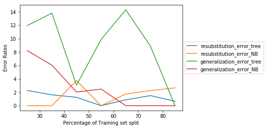
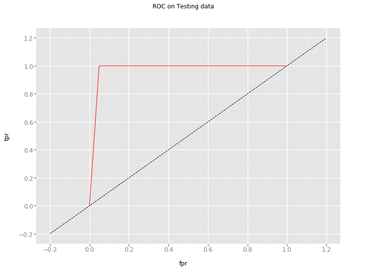
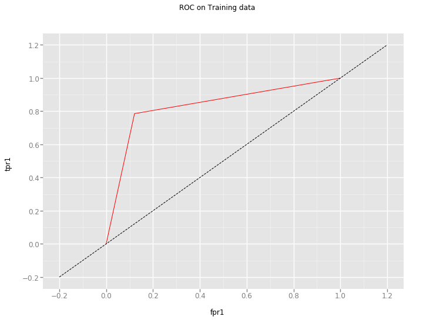
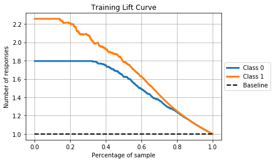
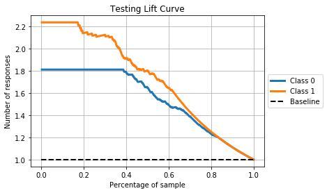
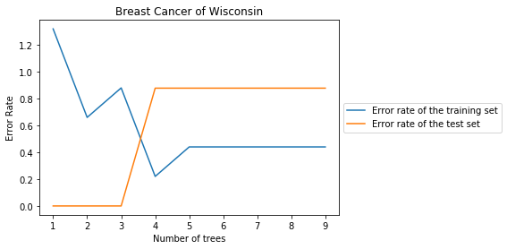
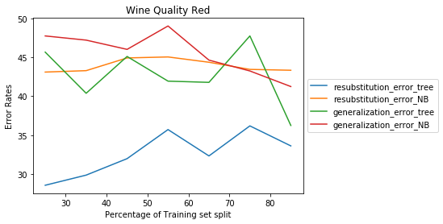
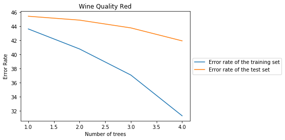
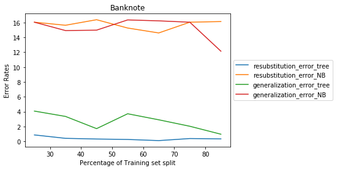
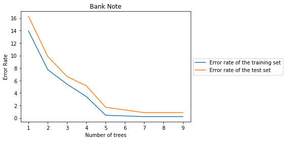

```python
import pandas as pd
import numpy as np
import scipy.io
import matplotlib
import matplotlib.pylab as plt
import random
import scikitplot as skplt

from sklearn import cross_validation

#Import sampling helper
from sklearn.model_selection import train_test_split, cross_val_score

#Import preprocessing modulesPython
from sklearn import preprocessing,metrics
from sklearn.pipeline import Pipeline

from sklearn.discriminant_analysis import LinearDiscriminantAnalysis

from sklearn.linear_model import ElasticNet
#Import evaluation metricsPython
from sklearn.metrics import mean_squared_error,r2_score

#Import cross-validation pipelinePython
from sklearn.pipeline import make_pipeline
from sklearn.model_selection import GridSearchCV

from sklearn.metrics import classification_report, confusion_matrix,precision_recall_fscore_support
from sklearn.preprocessing import StandardScaler

# To model the decision tree 
from sklearn.tree import DecisionTreeClassifier
# To model the Gaussian Navie Bayes classifier
from sklearn.naive_bayes import GaussianNB

import seaborn as sns
from math import sqrt
import scipy.stats as stats
```


```python
filename = "/Users/Wine.txt"
columns = ["Class","Alcohol","Malic_acid","Ash","Alcal_ash",
           "Mag","Total_ph","Flav_ph","Nonflav_ph","Proan", 
           "Color_inten","Hue","Diluted", "Proline"]
winedata = pd.read_csv(filename, header = None, sep=',',names = columns)
df = winedata.copy(deep=True)
#df= df.reset_index().values
```


```python
winedata.shape
```


    (178, 14)


```python
winedata.head()
```


<div>
<style scoped>
    .dataframe tbody tr th:only-of-type {
        vertical-align: middle;
    }

    .dataframe tbody tr th {
        vertical-align: top;
    }

    .dataframe thead th {
        text-align: right;
    }
</style>
<table border="1" class="dataframe">
  <thead>
    <tr style="text-align: right;">
      <th></th>
      <th>Class</th>
      <th>Alcohol</th>
      <th>Malic_acid</th>
      <th>Ash</th>
      <th>Alcal_ash</th>
      <th>Mag</th>
      <th>Total_ph</th>
      <th>Flav_ph</th>
      <th>Nonflav_ph</th>
      <th>Proan</th>
      <th>Color_inten</th>
      <th>Hue</th>
      <th>Diluted</th>
      <th>Proline</th>
    </tr>
  </thead>
  <tbody>
    <tr>
      <th>0</th>
      <td>1</td>
      <td>14.23</td>
      <td>1.71</td>
      <td>2.43</td>
      <td>15.6</td>
      <td>127</td>
      <td>2.80</td>
      <td>3.06</td>
      <td>0.28</td>
      <td>2.29</td>
      <td>5.64</td>
      <td>1.04</td>
      <td>3.92</td>
      <td>1065</td>
    </tr>
    <tr>
      <th>1</th>
      <td>1</td>
      <td>13.20</td>
      <td>1.78</td>
      <td>2.14</td>
      <td>11.2</td>
      <td>100</td>
      <td>2.65</td>
      <td>2.76</td>
      <td>0.26</td>
      <td>1.28</td>
      <td>4.38</td>
      <td>1.05</td>
      <td>3.40</td>
      <td>1050</td>
    </tr>
    <tr>
      <th>2</th>
      <td>1</td>
      <td>13.16</td>
      <td>2.36</td>
      <td>2.67</td>
      <td>18.6</td>
      <td>101</td>
      <td>2.80</td>
      <td>3.24</td>
      <td>0.30</td>
      <td>2.81</td>
      <td>5.68</td>
      <td>1.03</td>
      <td>3.17</td>
      <td>1185</td>
    </tr>
    <tr>
      <th>3</th>
      <td>1</td>
      <td>14.37</td>
      <td>1.95</td>
      <td>2.50</td>
      <td>16.8</td>
      <td>113</td>
      <td>3.85</td>
      <td>3.49</td>
      <td>0.24</td>
      <td>2.18</td>
      <td>7.80</td>
      <td>0.86</td>
      <td>3.45</td>
      <td>1480</td>
    </tr>
    <tr>
      <th>4</th>
      <td>1</td>
      <td>13.24</td>
      <td>2.59</td>
      <td>2.87</td>
      <td>21.0</td>
      <td>118</td>
      <td>2.80</td>
      <td>2.69</td>
      <td>0.39</td>
      <td>1.82</td>
      <td>4.32</td>
      <td>1.04</td>
      <td>2.93</td>
      <td>735</td>
    </tr>
  </tbody>
</table>
</div>


```python
# split data to X and y in numpy array
y = df['Class'].values
X = df.loc[:, 'Alcohol':].values
```

targetnames = X.columns


```python
df.describe()
```


<div>
<style scoped>
    .dataframe tbody tr th:only-of-type {
        vertical-align: middle;
    }

    .dataframe tbody tr th {
        vertical-align: top;
    }

    .dataframe thead th {
        text-align: right;
    }
</style>
<table border="1" class="dataframe">
  <thead>
    <tr style="text-align: right;">
      <th></th>
      <th>Class</th>
      <th>Alcohol</th>
      <th>Malic_acid</th>
      <th>Ash</th>
      <th>Alcal_ash</th>
      <th>Mag</th>
      <th>Total_ph</th>
      <th>Flav_ph</th>
      <th>Nonflav_ph</th>
      <th>Proan</th>
      <th>Color_inten</th>
      <th>Hue</th>
      <th>Diluted</th>
      <th>Proline</th>
    </tr>
  </thead>
  <tbody>
    <tr>
      <th>count</th>
      <td>178.000000</td>
      <td>178.000000</td>
      <td>178.000000</td>
      <td>178.000000</td>
      <td>178.000000</td>
      <td>178.000000</td>
      <td>178.000000</td>
      <td>178.000000</td>
      <td>178.000000</td>
      <td>178.000000</td>
      <td>178.000000</td>
      <td>178.000000</td>
      <td>178.000000</td>
      <td>178.000000</td>
    </tr>
    <tr>
      <th>mean</th>
      <td>1.938202</td>
      <td>13.000618</td>
      <td>2.336348</td>
      <td>2.366517</td>
      <td>19.494944</td>
      <td>99.741573</td>
      <td>2.295112</td>
      <td>2.029270</td>
      <td>0.361854</td>
      <td>1.590899</td>
      <td>5.058090</td>
      <td>0.957449</td>
      <td>2.611685</td>
      <td>746.893258</td>
    </tr>
    <tr>
      <th>std</th>
      <td>0.775035</td>
      <td>0.811827</td>
      <td>1.117146</td>
      <td>0.274344</td>
      <td>3.339564</td>
      <td>14.282484</td>
      <td>0.625851</td>
      <td>0.998859</td>
      <td>0.124453</td>
      <td>0.572359</td>
      <td>2.318286</td>
      <td>0.228572</td>
      <td>0.709990</td>
      <td>314.907474</td>
    </tr>
    <tr>
      <th>min</th>
      <td>1.000000</td>
      <td>11.030000</td>
      <td>0.740000</td>
      <td>1.360000</td>
      <td>10.600000</td>
      <td>70.000000</td>
      <td>0.980000</td>
      <td>0.340000</td>
      <td>0.130000</td>
      <td>0.410000</td>
      <td>1.280000</td>
      <td>0.480000</td>
      <td>1.270000</td>
      <td>278.000000</td>
    </tr>
    <tr>
      <th>25%</th>
      <td>1.000000</td>
      <td>12.362500</td>
      <td>1.602500</td>
      <td>2.210000</td>
      <td>17.200000</td>
      <td>88.000000</td>
      <td>1.742500</td>
      <td>1.205000</td>
      <td>0.270000</td>
      <td>1.250000</td>
      <td>3.220000</td>
      <td>0.782500</td>
      <td>1.937500</td>
      <td>500.500000</td>
    </tr>
    <tr>
      <th>50%</th>
      <td>2.000000</td>
      <td>13.050000</td>
      <td>1.865000</td>
      <td>2.360000</td>
      <td>19.500000</td>
      <td>98.000000</td>
      <td>2.355000</td>
      <td>2.135000</td>
      <td>0.340000</td>
      <td>1.555000</td>
      <td>4.690000</td>
      <td>0.965000</td>
      <td>2.780000</td>
      <td>673.500000</td>
    </tr>
    <tr>
      <th>75%</th>
      <td>3.000000</td>
      <td>13.677500</td>
      <td>3.082500</td>
      <td>2.557500</td>
      <td>21.500000</td>
      <td>107.000000</td>
      <td>2.800000</td>
      <td>2.875000</td>
      <td>0.437500</td>
      <td>1.950000</td>
      <td>6.200000</td>
      <td>1.120000</td>
      <td>3.170000</td>
      <td>985.000000</td>
    </tr>
    <tr>
      <th>max</th>
      <td>3.000000</td>
      <td>14.830000</td>
      <td>5.800000</td>
      <td>3.230000</td>
      <td>30.000000</td>
      <td>162.000000</td>
      <td>3.880000</td>
      <td>5.080000</td>
      <td>0.660000</td>
      <td>3.580000</td>
      <td>13.000000</td>
      <td>1.710000</td>
      <td>4.000000</td>
      <td>1680.000000</td>
    </tr>
  </tbody>
</table>
</div>


```python
df.corr()
```


<div>
<style scoped>
    .dataframe tbody tr th:only-of-type {
        vertical-align: middle;
    }

    .dataframe tbody tr th {
        vertical-align: top;
    }

    .dataframe thead th {
        text-align: right;
    }
</style>
<table border="1" class="dataframe">
  <thead>
    <tr style="text-align: right;">
      <th></th>
      <th>Class</th>
      <th>Alcohol</th>
      <th>Malic_acid</th>
      <th>Ash</th>
      <th>Alcal_ash</th>
      <th>Mag</th>
      <th>Total_ph</th>
      <th>Flav_ph</th>
      <th>Nonflav_ph</th>
      <th>Proan</th>
      <th>Color_inten</th>
      <th>Hue</th>
      <th>Diluted</th>
      <th>Proline</th>
    </tr>
  </thead>
  <tbody>
    <tr>
      <th>Class</th>
      <td>1.000000</td>
      <td>-0.328222</td>
      <td>0.437776</td>
      <td>-0.049643</td>
      <td>0.517859</td>
      <td>-0.209179</td>
      <td>-0.719163</td>
      <td>-0.847498</td>
      <td>0.489109</td>
      <td>-0.499130</td>
      <td>0.265668</td>
      <td>-0.617369</td>
      <td>-0.788230</td>
      <td>-0.633717</td>
    </tr>
    <tr>
      <th>Alcohol</th>
      <td>-0.328222</td>
      <td>1.000000</td>
      <td>0.094397</td>
      <td>0.211545</td>
      <td>-0.310235</td>
      <td>0.270798</td>
      <td>0.289101</td>
      <td>0.236815</td>
      <td>-0.155929</td>
      <td>0.136698</td>
      <td>0.546364</td>
      <td>-0.071747</td>
      <td>0.072343</td>
      <td>0.643720</td>
    </tr>
    <tr>
      <th>Malic_acid</th>
      <td>0.437776</td>
      <td>0.094397</td>
      <td>1.000000</td>
      <td>0.164045</td>
      <td>0.288500</td>
      <td>-0.054575</td>
      <td>-0.335167</td>
      <td>-0.411007</td>
      <td>0.292977</td>
      <td>-0.220746</td>
      <td>0.248985</td>
      <td>-0.561296</td>
      <td>-0.368710</td>
      <td>-0.192011</td>
    </tr>
    <tr>
      <th>Ash</th>
      <td>-0.049643</td>
      <td>0.211545</td>
      <td>0.164045</td>
      <td>1.000000</td>
      <td>0.443367</td>
      <td>0.286587</td>
      <td>0.128980</td>
      <td>0.115077</td>
      <td>0.186230</td>
      <td>0.009652</td>
      <td>0.258887</td>
      <td>-0.074667</td>
      <td>0.003911</td>
      <td>0.223626</td>
    </tr>
    <tr>
      <th>Alcal_ash</th>
      <td>0.517859</td>
      <td>-0.310235</td>
      <td>0.288500</td>
      <td>0.443367</td>
      <td>1.000000</td>
      <td>-0.083333</td>
      <td>-0.321113</td>
      <td>-0.351370</td>
      <td>0.361922</td>
      <td>-0.197327</td>
      <td>0.018732</td>
      <td>-0.273955</td>
      <td>-0.276769</td>
      <td>-0.440597</td>
    </tr>
    <tr>
      <th>Mag</th>
      <td>-0.209179</td>
      <td>0.270798</td>
      <td>-0.054575</td>
      <td>0.286587</td>
      <td>-0.083333</td>
      <td>1.000000</td>
      <td>0.214401</td>
      <td>0.195784</td>
      <td>-0.256294</td>
      <td>0.236441</td>
      <td>0.199950</td>
      <td>0.055398</td>
      <td>0.066004</td>
      <td>0.393351</td>
    </tr>
    <tr>
      <th>Total_ph</th>
      <td>-0.719163</td>
      <td>0.289101</td>
      <td>-0.335167</td>
      <td>0.128980</td>
      <td>-0.321113</td>
      <td>0.214401</td>
      <td>1.000000</td>
      <td>0.864564</td>
      <td>-0.449935</td>
      <td>0.612413</td>
      <td>-0.055136</td>
      <td>0.433681</td>
      <td>0.699949</td>
      <td>0.498115</td>
    </tr>
    <tr>
      <th>Flav_ph</th>
      <td>-0.847498</td>
      <td>0.236815</td>
      <td>-0.411007</td>
      <td>0.115077</td>
      <td>-0.351370</td>
      <td>0.195784</td>
      <td>0.864564</td>
      <td>1.000000</td>
      <td>-0.537900</td>
      <td>0.652692</td>
      <td>-0.172379</td>
      <td>0.543479</td>
      <td>0.787194</td>
      <td>0.494193</td>
    </tr>
    <tr>
      <th>Nonflav_ph</th>
      <td>0.489109</td>
      <td>-0.155929</td>
      <td>0.292977</td>
      <td>0.186230</td>
      <td>0.361922</td>
      <td>-0.256294</td>
      <td>-0.449935</td>
      <td>-0.537900</td>
      <td>1.000000</td>
      <td>-0.365845</td>
      <td>0.139057</td>
      <td>-0.262640</td>
      <td>-0.503270</td>
      <td>-0.311385</td>
    </tr>
    <tr>
      <th>Proan</th>
      <td>-0.499130</td>
      <td>0.136698</td>
      <td>-0.220746</td>
      <td>0.009652</td>
      <td>-0.197327</td>
      <td>0.236441</td>
      <td>0.612413</td>
      <td>0.652692</td>
      <td>-0.365845</td>
      <td>1.000000</td>
      <td>-0.025250</td>
      <td>0.295544</td>
      <td>0.519067</td>
      <td>0.330417</td>
    </tr>
    <tr>
      <th>Color_inten</th>
      <td>0.265668</td>
      <td>0.546364</td>
      <td>0.248985</td>
      <td>0.258887</td>
      <td>0.018732</td>
      <td>0.199950</td>
      <td>-0.055136</td>
      <td>-0.172379</td>
      <td>0.139057</td>
      <td>-0.025250</td>
      <td>1.000000</td>
      <td>-0.521813</td>
      <td>-0.428815</td>
      <td>0.316100</td>
    </tr>
    <tr>
      <th>Hue</th>
      <td>-0.617369</td>
      <td>-0.071747</td>
      <td>-0.561296</td>
      <td>-0.074667</td>
      <td>-0.273955</td>
      <td>0.055398</td>
      <td>0.433681</td>
      <td>0.543479</td>
      <td>-0.262640</td>
      <td>0.295544</td>
      <td>-0.521813</td>
      <td>1.000000</td>
      <td>0.565468</td>
      <td>0.236183</td>
    </tr>
    <tr>
      <th>Diluted</th>
      <td>-0.788230</td>
      <td>0.072343</td>
      <td>-0.368710</td>
      <td>0.003911</td>
      <td>-0.276769</td>
      <td>0.066004</td>
      <td>0.699949</td>
      <td>0.787194</td>
      <td>-0.503270</td>
      <td>0.519067</td>
      <td>-0.428815</td>
      <td>0.565468</td>
      <td>1.000000</td>
      <td>0.312761</td>
    </tr>
    <tr>
      <th>Proline</th>
      <td>-0.633717</td>
      <td>0.643720</td>
      <td>-0.192011</td>
      <td>0.223626</td>
      <td>-0.440597</td>
      <td>0.393351</td>
      <td>0.498115</td>
      <td>0.494193</td>
      <td>-0.311385</td>
      <td>0.330417</td>
      <td>0.316100</td>
      <td>0.236183</td>
      <td>0.312761</td>
      <td>1.000000</td>
    </tr>
  </tbody>
</table>
</div>


```python
#winedata.to_csv("/Users/winedata.csv")
```


```python
# split 66% for training and 34% for testing
for i in range(30):
    X_train, X_test, y_train, y_test = train_test_split(X, y, test_size=0.34, random_state=0,shuffle = True)
```


```python
# normalized the data
scaler = StandardScaler()
scaler.fit(X_train)
X_train = scaler.transform(X_train)
X_test = scaler.transform(X_test)
```


```python
# Decision tree, Navie Bayes classifers
DTree = DecisionTreeClassifier()
NB = GaussianNB()
```


```python
param_grid = {'criterion':['gini','entropy'],'max_depth': np.arange(2, 10), 
              'min_samples_split':np.arange(2,10),'min_samples_leaf':np.arange(2,10)}
```


```python
# use GridSearch to find the best parameters 
gs_tree = GridSearchCV(DTree, param_grid, cv=10)
gs_tree.fit(X_train,y_train)
gs_tree.best_params_
```


    {'criterion': 'entropy',
     'max_depth': 3,
     'min_samples_leaf': 3,
     'min_samples_split': 2}


```python
# on 66% of training
DTree1 = DecisionTreeClassifier(min_samples_split=3,max_depth=3,
                                min_samples_leaf=7,random_state=100)
DTree1.fit(X_train,y_train)
DT_test_pred = DTree1.predict(X_test)
DT_train_pred = DTree1.predict(X_train)
```


```python
# split 25% for training 
for i in range(30):
    X_train, X_test, y_train, y_test = train_test_split(X, y, train_size=0.25, random_state=10,shuffle = True)

# on 25% training
DTree1 = DecisionTreeClassifier(min_samples_split=3,max_depth=2,
                                min_samples_leaf=2,random_state=10)
DTree1.fit(X_train,y_train)
DT_test_pred = DTree1.predict(X_test)
DT_train_pred = DTree1.predict(X_train)

# 25% training
resubstitution_error_tree1 = (1-metrics.accuracy_score(y_train, DT_train_pred))*100

generalization_error_tree1 = (1 - metrics.accuracy_score(y_test, DT_test_pred)) * 100

print resubstitution_error_tree1, generalization_error_tree1
```

    2.2727272727272707 11.940298507462687


```python
# split 25% for training 
for i in range(30):
    X_train, X_test, y_train, y_test = train_test_split(X, y, train_size=0.25, random_state=10,shuffle = True)

# on 25% training
NB = GaussianNB()
NB.fit(X_train, y_train)
NB_train_pre = NB.predict(X_train)
NB_test_pre = NB.predict(X_test)

# 25% training
resubstitution_error_NB1 = (1-metrics.accuracy_score(y_train, NB_train_pre))*100

generalization_error_NB1 = (1 - metrics.accuracy_score(y_test, NB_test_pre)) * 100

print resubstitution_error_NB1, generalization_error_NB1
```

    0.0 8.208955223880599


```python
# split 35% for training 
for i in range(30):
    X_train, X_test, y_train, y_test = train_test_split(X, y, train_size=0.35, random_state=10,shuffle = True)

# on 35% training
DTree1 = DecisionTreeClassifier(min_samples_split=3,max_depth=2,
                                min_samples_leaf=2,random_state=20)
DTree1.fit(X_train,y_train)
DT_test_pred = DTree1.predict(X_test)
DT_train_pred = DTree1.predict(X_train)

# 35% training
resubstitution_error_tree2 = (1-metrics.accuracy_score(y_train, DT_train_pred))*100

generalization_error_tree2 = (1 - metrics.accuracy_score(y_test, DT_test_pred)) * 100

print resubstitution_error_tree2, generalization_error_tree2
```

    1.6129032258064502 13.793103448275868


```python
# split 35% for training 
for i in range(30):
    X_train, X_test, y_train, y_test = train_test_split(X, y, train_size=0.35, random_state=10,shuffle = True)

# on 35% training
NB = GaussianNB()
NB.fit(X_train, y_train)
NB_train_pre = NB.predict(X_train)
NB_test_pre = NB.predict(X_test)

# 35% training
resubstitution_error_NB2 = (1-metrics.accuracy_score(y_train, NB_train_pre))*100

generalization_error_NB2 = (1 - metrics.accuracy_score(y_test, NB_test_pre)) * 100

print resubstitution_error_NB2, generalization_error_NB2
```

    0.0 6.034482758620685


```python
# split 45% for training 
for i in range(30):
    X_train, X_test, y_train, y_test = train_test_split(X, y, train_size=0.45, random_state=20,shuffle = True)

# 45% training 
DTree1 = DecisionTreeClassifier(min_samples_split=3,max_depth=4,
                                min_samples_leaf=2,random_state=30)
DTree1.fit(X_train,y_train)
DT_test_pred = DTree1.predict(X_test)
DT_train_pred = DTree1.predict(X_train)

# 45% training
resubstitution_error_tree3 = (1-metrics.accuracy_score(y_train, DT_train_pred))*100

generalization_error_tree3 = (1 - metrics.accuracy_score(y_test, DT_test_pred)) * 100

print resubstitution_error_tree3, generalization_error_tree3
```

    1.2499999999999956 3.0612244897959218


```python
# split 45% for training 
for i in range(30):
    X_train, X_test, y_train, y_test = train_test_split(X, y, train_size=0.45, random_state=20,shuffle = True)

# on 45% training
NB = GaussianNB()
NB.fit(X_train, y_train)
NB_train_pre = NB.predict(X_train)
NB_test_pre = NB.predict(X_test)

# 45% training
resubstitution_error_NB3 = (1-metrics.accuracy_score(y_train, NB_train_pre))*100

generalization_error_NB3 = (1 - metrics.accuracy_score(y_test, NB_test_pre)) * 100

print resubstitution_error_NB3, generalization_error_NB3
```

    3.749999999999998 2.0408163265306145


```python
# split 55% for training 
for i in range(30):
    X_train, X_test, y_train, y_test = train_test_split(X, y, train_size=0.55, random_state=30,shuffle = True)

# 55% training 
DTree1 = DecisionTreeClassifier(min_samples_split=2,max_depth=7,
                                min_samples_leaf=2,random_state=40)
DTree1.fit(X_train,y_train)
DT_test_pred = DTree1.predict(X_test)
DT_train_pred = DTree1.predict(X_train)

# 55% training
resubstitution_error_tree4 = (1-metrics.accuracy_score(y_train, DT_train_pred))*100

generalization_error_tree4 = (1 - metrics.accuracy_score(y_test, DT_test_pred)) * 100
print resubstitution_error_tree4, generalization_error_tree4
```

    0.0 9.876543209876543


```python
# split 55% for training 
for i in range(30):
    X_train, X_test, y_train, y_test = train_test_split(X, y, train_size=0.55, random_state=30,shuffle = True)

# on 55% training
NB = GaussianNB()
NB.fit(X_train, y_train)
NB_train_pre = NB.predict(X_train)
NB_test_pre = NB.predict(X_test)

# 55% training
resubstitution_error_NB4 = (1-metrics.accuracy_score(y_train, NB_train_pre))*100

generalization_error_NB4 = (1 - metrics.accuracy_score(y_test, NB_test_pre)) * 100

print resubstitution_error_NB4, generalization_error_NB4
```

    0.0 2.4691358024691357


```python
# split 65% for training 
for i in range(30):
    X_train, X_test, y_train, y_test = train_test_split(X, y, train_size=0.65, random_state=40,shuffle = True)

# 65% training 
DTree1 = DecisionTreeClassifier(min_samples_split=2,max_depth=3,
                                min_samples_leaf=2,random_state=50)
DTree1.fit(X_train,y_train)
DT_test_pred = DTree1.predict(X_test)
DT_train_pred = DTree1.predict(X_train)

# 65% training
resubstitution_error_tree5 = (1-metrics.accuracy_score(y_train, DT_train_pred))*100

generalization_error_tree5 = (1 - metrics.accuracy_score(y_test, DT_test_pred)) * 100

print resubstitution_error_tree5, generalization_error_tree5
```

    0.8695652173912993 14.28571428571429


```python
# split 65% for training 
for i in range(30):
    X_train, X_test, y_train, y_test = train_test_split(X, y, train_size=0.65, random_state=40,shuffle = True)

# 65% training 
NB = GaussianNB()
NB.fit(X_train, y_train)
NB_train_pre = NB.predict(X_train)
NB_test_pre = NB.predict(X_test)

# 65% training
resubstitution_error_NB5 = (1-metrics.accuracy_score(y_train, NB_train_pre))*100

generalization_error_NB5 = (1 - metrics.accuracy_score(y_test, NB_test_pre)) * 100

print resubstitution_error_NB5, generalization_error_NB5
```

    1.7391304347826098 0.0


```python
# split 75% for training 
for i in range(30):
    X_train, X_test, y_train, y_test = train_test_split(X, y, train_size=0.75, random_state=50,shuffle = True)

# 75% training 
DTree1 = DecisionTreeClassifier(min_samples_split=2,max_depth=3,
                                min_samples_leaf=3,random_state=60)
DTree1.fit(X_train,y_train)
DT_test_pred = DTree1.predict(X_test)
DT_train_pred = DTree1.predict(X_train)

# 75% training
resubstitution_error_tree6 = (1-metrics.accuracy_score(y_train, DT_train_pred))*100

generalization_error_tree6 = (1 - metrics.accuracy_score(y_test, DT_test_pred)) * 100

print resubstitution_error_tree6, generalization_error_tree6
```

    1.5037593984962405 8.888888888888891


```python
# split 75% for training 
for i in range(30):
    X_train, X_test, y_train, y_test = train_test_split(X, y, train_size=0.75, random_state=40,shuffle = True)

# 75% training 
NB = GaussianNB()
NB.fit(X_train, y_train)
NB_train_pre = NB.predict(X_train)
NB_test_pre = NB.predict(X_test)

# 65% training
resubstitution_error_NB6 = (1-metrics.accuracy_score(y_train, NB_train_pre))*100

generalization_error_NB6 = (1 - metrics.accuracy_score(y_test, NB_test_pre)) * 100

print resubstitution_error_NB6, generalization_error_NB6
```

    2.2556390977443663 0.0


```python
# split 85% for training 
for i in range(30):
    X_train, X_test, y_train, y_test = train_test_split(X, y, train_size=0.85, random_state=60,shuffle = True)

# 85% training 
DTree1 = DecisionTreeClassifier(min_samples_split=2,max_depth=3,
                                min_samples_leaf=3,random_state=70)
DTree1.fit(X_train,y_train)
DT_test_pred = DTree1.predict(X_test)
DT_train_pred = DTree1.predict(X_train)

# 85% training
resubstitution_error_tree7 = (1-metrics.accuracy_score(y_train, DT_train_pred))*100

generalization_error_tree7 = (1 - metrics.accuracy_score(y_test, DT_test_pred)) * 100

print resubstitution_error_tree7, generalization_error_tree7
```

    0.6622516556291425 0.0


```python
# split 85% for training 
for i in range(30):
    X_train, X_test, y_train, y_test = train_test_split(X, y, train_size=0.85, random_state=60,shuffle = True)

# 85% training 
NB = GaussianNB()
NB.fit(X_train, y_train)
NB_train_pre = NB.predict(X_train)
NB_test_pre = NB.predict(X_test)

# 85% training
resubstitution_error_NB7 = (1-metrics.accuracy_score(y_train, NB_train_pre))*100

generalization_error_NB7 = (1 - metrics.accuracy_score(y_test, NB_test_pre)) * 100

print resubstitution_error_NB7, generalization_error_NB7
```

    2.6490066225165587 0.0


```python
resubstitution_error_tree = []
resubstitution_error_tree.extend((resubstitution_error_tree1,resubstitution_error_tree2,
                                 resubstitution_error_tree3,resubstitution_error_tree4,
                                 resubstitution_error_tree5,resubstitution_error_tree6,
                                 resubstitution_error_tree7))
resubstitution_error_NB = []
resubstitution_error_NB.extend((resubstitution_error_NB1,resubstitution_error_NB2,
                                 resubstitution_error_NB3,resubstitution_error_NB4,
                                 resubstitution_error_NB5,resubstitution_error_NB6,
                                 resubstitution_error_NB7))

generalization_error_tree = []
generalization_error_NB = []

generalization_error_tree.extend((generalization_error_tree1,generalization_error_tree2,
                                 generalization_error_tree3,generalization_error_tree4,
                                 generalization_error_tree5,generalization_error_tree6,
                                 generalization_error_tree7))
generalization_error_NB.extend((generalization_error_NB1,generalization_error_NB2,
                               generalization_error_NB3,generalization_error_NB4,
                               generalization_error_NB5,generalization_error_NB6,
                               generalization_error_NB7))
```


```python
generalization_error_NB
```


    [8.208955223880599,
     6.034482758620685,
     2.0408163265306145,
     2.4691358024691357,
     0.0,
     0.0,
     0.0]


```python
x = range(25,90,10)

plt.xlabel("Percentage of Training set split")
plt.ylabel("Error Rates")

plt.plot(x, resubstitution_error_tree, label = "resubstitution_error_tree")
plt.plot(x, resubstitution_error_NB, label = "resubstitution_error_NB")
plt.plot(x, generalization_error_tree, label = "generalization_error_tree")
plt.plot(x, generalization_error_NB, label = "generalization_error_NB")
plt.legend(loc='center left', bbox_to_anchor=(1, 0.5))
plt.show()
```





```python
# Gaussian Navie Bayes classifier
NB = GaussianNB()
NB.fit(X_train, y_train)
NB_train_pre = NB.predict(X_train)
NB_test_pre = NB.predict(X_test)
```


```python
n_train = len(X_train) + len(y_train)
n_train
```


    234


```python
n_test = len(X_test) + len(y_test)
n_test
```


    122


```python
# Get Decision tree classifier train and test mean and variance
outputs = []
outputs1 = []

RMSE_tree = sqrt(mean_squared_error(y_test,DT_test_pred))
RMSE_tree1 = sqrt(mean_squared_error(y_train,DT_train_pred))

outputs.append(RMSE_tree)
outputs1.append(RMSE_tree1)


mean_tree_test = sum(outputs)/10
mean_tree_train = sum(outputs1)/10

variance_tree_test = sum((x-mean_tree_test)**2 for x in outputs)
variance_tree_train = sum((x-mean_tree_train)**2 for x in outputs1)

std_tree_test = sqrt(variance_tree_test)
std_tree_train = sqrt(variance_tree_train)

CI_test = (mean_tree_test + 1.96*((std_tree_test)/sqrt(n_test)),
           mean_tree_test - 1.96*((std_tree_test)/sqrt(n_test)))

CI_train = (mean_tree_train + 1.96*((std_tree_train)/sqrt(n_train)),
           mean_tree_train - 1.96*((std_tree_train)/sqrt(n_train)))

print "Decision tree classifier testing set mean is:", mean_tree_test, "and variance is:", variance_tree_test
print "Decision tree classifier training set mean is:", mean_tree_train, "and variance is:", variance_tree_train
print ""

print "Decision tree classifier testing set Confidence Interval is:", CI_test
print ""
print "Decision tree classifier training set Confidence Interval is:", CI_train
print ""


print "The accuracy on training data set is" ,metrics.accuracy_score(y_train, DT_train_pred)
print ""
print "The accuracy on testing data set is" ,metrics.accuracy_score(y_test, DT_test_pred)


```

    Decision tree classifier testing set mean is: 0.0256073759866 and variance is: 0.0531147540984
    Decision tree classifier training set mean is: 0.0184900065408 and variance is: 0.0276923076923
    
    Decision tree classifier testing set Confidence Interval is: (0.06650365015094215, -0.015288898177783748)
    
    Decision tree classifier training set Confidence Interval is: (0.03981199563508148, -0.0028319825533995382)
    
    The accuracy on training data set is 0.9658119658119658
    
    The accuracy on testing data set is 0.9344262295081968


```python
ACC_DT_test = metrics.accuracy_score(y_test, DT_test_pred)
ACC_DT_test
```


    0.9344262295081968


```python
ACC_NB_test = metrics.accuracy_score(y_test, NB_test_pre)
ACC_NB_test
```


    0.9508196721311475


```python
# Get Navie Bayes classifier train and test mean and variance
lists = []
lists1 = []

RMSE_NB = sqrt(mean_squared_error(y_test,NB_test_pre))
RMSE_NB1 = sqrt(mean_squared_error(y_train,NB_train_pre))

lists.append(RMSE_NB)
lists1.append(RMSE_NB1)


mean_NB_test = sum(lists)/10
mean_NB_train = sum(lists1)/10

variance_NB_test = sum((x-mean_NB_test)**2 for x in lists)
variance_NB_train = sum((x-mean_NB_train)**2 for x in lists1)

std_NB_test = sqrt(variance_NB_test)
std_NB_train = sqrt(variance_NB_train)

CI_NB_test = (mean_NB_test + 1.96*((std_NB_test)/sqrt(n_test)),
           mean_NB_test - 1.96*((std_NB_test)/sqrt(n_test)))

CI_NB_train = (mean_NB_train + 1.96*((std_NB_train)/sqrt(n_train)),
           mean_NB_train - 1.96*((std_NB_train)/sqrt(n_train)))

print "Navie Bayes classifier testing set mean is:", mean_NB_test, "and variance is:", variance_NB_test
print "Navie Bayes classifier training set mean is:", mean_NB_train, "and variance is:", variance_NB_train
print ""

print "Navie Bayes classifier testing set Confidence Interval is:", CI_NB_test
print ""
print "Navie Bayes classifier training set Confidence Interval is:", CI_NB_train
print ""


print "The accuracy on training data set is" ,metrics.accuracy_score(y_train, NB_train_pre)
print ""
print "The accuracy on testing data set is" ,metrics.accuracy_score(y_test, NB_test_pre)

```

    Navie Bayes classifier testing set mean is: 0.0221766381286 and variance is: 0.0398360655738
    Navie Bayes classifier training set mean is: 0.0130744090092 and variance is: 0.0138461538462
    
    Navie Bayes classifier testing set Confidence Interval is: (0.057593850475108704, -0.013240574217834335)
    
    Navie Bayes classifier training set Confidence Interval is: (0.02815133208613535, -0.0020025140677108096)
    
    The accuracy on training data set is 0.9829059829059829
    
    The accuracy on testing data set is 0.9508196721311475


```python
# Using a pair t-test, compare the mean accuracy of the Naïve Bayes 
#and the mean accuracy of the Decision tree and discuss the results.
stats.ttest_rel(NB_test_pre,DT_test_pred)
```


    Ttest_relResult(statistic=-2.3145502494313788, pvalue=0.024077327443763293)


```python
import numpy as np, statsmodels.stats.api as sms

cm = sms.CompareMeans(sms.DescrStatsW(NB_test_pre), sms.DescrStatsW(DT_test_pred))
print cm.tconfint_diff(usevar='unequal')
```

    (-0.36487801596637665, 0.2009435897368687)


```python
DT_acc_train = metrics.accuracy_score(y_train, DT_train_pred)
DT_acc_test = metrics.accuracy_score(y_test, DT_test_pred)
```


```python
NB_acc_train = metrics.accuracy_score(y_train, NB_train_pre)
NB_acc_test = metrics.accuracy_score(y_test, NB_test_pre)
```

## Problem 3 a.	Repeat Problem 2.b from Assignment#1 on the Wine Recognition Dataset but this time considering only two classes (let us say, class 1 (positive class) versus class 2 and class 3 (negative class) since the ROC and lift curves can only be drawn for binary classification problems).


```python
y1 = y
X1 = X
```


```python
# transform class 1 to positive value 1, and class 2 and 3 to 0 (negative value)
def transform (y):
    return (y==1) *1
```


```python
# transform y1 'class'
y1 = transform(y1)
```


```python
# split 66% for training and 34% for testing
for i in range(30):
    X_train, X_test, y_train, y_test = train_test_split(X, y1, test_size=0.34, random_state=0,shuffle = True)
    
# normalized the data
scaler = StandardScaler()
scaler.fit(X_train)
X_train = scaler.transform(X_train)
X_test = scaler.transform(X_test)

NB = GaussianNB()
NB.fit(X_train, y_train)
NB_train_pre = NB.predict(X_train)
NB_test_pre = NB.predict(X_test)
```


```python
from sklearn import metrics
from ggplot import *
# ROC on testing set
fpr, tpr, threshold= metrics.roc_curve(y_test, NB_test_pre)
roc_auc = metrics.auc(fpr, tpr)
# ROC on training set
fpr1,tpr1, threshold = metrics.roc_curve(y_train, NB_train_pre)
roc_auc1 = metrics.auc(fpr1, tpr1)
```


```python
threshold
```


    array([2, 1, 0])


```python
# make a dataframe for fpr and tpr
df2 = pd.DataFrame(dict(fpr=fpr, tpr=tpr))
ggplot(df2, aes(x='fpr', y='tpr')) +\
    geom_line(color='red') +\
    geom_abline(linetype='dashed') +\
    ggtitle("ROC on Testing data")
```





    <ggplot: (291222737)>


```python
# make a dataframe for fpr and tpr
df3 = pd.DataFrame(dict(fpr1=fpr1, tpr1=tpr1))
ggplot(df3, aes(x='fpr1', y='tpr1')) +\
    geom_line(color='red') +\
    geom_abline(linetype='dashed') +\
    ggtitle("ROC on Training data")
```





    <ggplot: (294884085)>


```python
# split 66% for training and 34% for testing
for i in range(30):
    X_train, X_test, y_train, y_test = train_test_split(X, y1, test_size=0.34, random_state=0,shuffle = True)
    
# normalized the data
scaler = StandardScaler()
scaler.fit(X_train)
X_train = scaler.transform(X_train)
X_test = scaler.transform(X_test)

NB = GaussianNB()
NB.fit(X_train, y_train)
NB_train_pre = NB.predict(X_train)
NB_test_pre = NB.predict(X_test)
```


```python
nb_probas = NB.fit(X_train, y_train).predict_proba(X_test)
train_probas = NB.fit(X_train, y_train).predict_proba(X_train)
```


```python
skplt.metrics.plot_lift_curve(y_train, train_probas)
plt.legend(loc='center left', bbox_to_anchor=(1, 0.5))
plt.title("Training Lift Curve")
plt.ylabel("Number of responses")
plt.show()
```





```python
skplt.metrics.plot_lift_curve(y_test, nb_probas)
plt.legend(loc='center left', bbox_to_anchor=(1, 0.5))
plt.title("Testing Lift Curve")
plt.ylabel("Number of responses")
plt.show()
```





### Problem 4: 
### The breast cancer Wisconsin dataset consists of 569 instances and 32 features.  The class variable represents diagnosis (M=malignant, B=benign) and the features are computed from a digitized image of a fine needle aspirate (FNA) of a breast mass. They describe characteristics of the cell nuclei present in the image. 


```python
# read wisconsin cancer data
data = pd.read_csv('/Users/ivy/Desktop/CSC529 /Assignments/wisconsin.csv')
dfw = data.copy(deep=True)
```


```python
dfw.shape
```


    (569, 32)


```python
dfw.head()
```


<div>
<style scoped>
    .dataframe tbody tr th:only-of-type {
        vertical-align: middle;
    }

    .dataframe tbody tr th {
        vertical-align: top;
    }

    .dataframe thead th {
        text-align: right;
    }
</style>
<table border="1" class="dataframe">
  <thead>
    <tr style="text-align: right;">
      <th></th>
      <th>id</th>
      <th>diagnosis</th>
      <th>radius_mean</th>
      <th>texture_mean</th>
      <th>perimeter_mean</th>
      <th>area_mean</th>
      <th>smoothness_mean</th>
      <th>compactness_mean</th>
      <th>concavity_mean</th>
      <th>concave points_mean</th>
      <th>...</th>
      <th>radius_worst</th>
      <th>texture_worst</th>
      <th>perimeter_worst</th>
      <th>area_worst</th>
      <th>smoothness_worst</th>
      <th>compactness_worst</th>
      <th>concavity_worst</th>
      <th>concave points_worst</th>
      <th>symmetry_worst</th>
      <th>fractal_dimension_worst</th>
    </tr>
  </thead>
  <tbody>
    <tr>
      <th>0</th>
      <td>842302</td>
      <td>M</td>
      <td>17.99</td>
      <td>10.38</td>
      <td>122.80</td>
      <td>1001.0</td>
      <td>0.11840</td>
      <td>0.27760</td>
      <td>0.3001</td>
      <td>0.14710</td>
      <td>...</td>
      <td>25.38</td>
      <td>17.33</td>
      <td>184.60</td>
      <td>2019.0</td>
      <td>0.1622</td>
      <td>0.6656</td>
      <td>0.7119</td>
      <td>0.2654</td>
      <td>0.4601</td>
      <td>0.11890</td>
    </tr>
    <tr>
      <th>1</th>
      <td>842517</td>
      <td>M</td>
      <td>20.57</td>
      <td>17.77</td>
      <td>132.90</td>
      <td>1326.0</td>
      <td>0.08474</td>
      <td>0.07864</td>
      <td>0.0869</td>
      <td>0.07017</td>
      <td>...</td>
      <td>24.99</td>
      <td>23.41</td>
      <td>158.80</td>
      <td>1956.0</td>
      <td>0.1238</td>
      <td>0.1866</td>
      <td>0.2416</td>
      <td>0.1860</td>
      <td>0.2750</td>
      <td>0.08902</td>
    </tr>
    <tr>
      <th>2</th>
      <td>84300903</td>
      <td>M</td>
      <td>19.69</td>
      <td>21.25</td>
      <td>130.00</td>
      <td>1203.0</td>
      <td>0.10960</td>
      <td>0.15990</td>
      <td>0.1974</td>
      <td>0.12790</td>
      <td>...</td>
      <td>23.57</td>
      <td>25.53</td>
      <td>152.50</td>
      <td>1709.0</td>
      <td>0.1444</td>
      <td>0.4245</td>
      <td>0.4504</td>
      <td>0.2430</td>
      <td>0.3613</td>
      <td>0.08758</td>
    </tr>
    <tr>
      <th>3</th>
      <td>84348301</td>
      <td>M</td>
      <td>11.42</td>
      <td>20.38</td>
      <td>77.58</td>
      <td>386.1</td>
      <td>0.14250</td>
      <td>0.28390</td>
      <td>0.2414</td>
      <td>0.10520</td>
      <td>...</td>
      <td>14.91</td>
      <td>26.50</td>
      <td>98.87</td>
      <td>567.7</td>
      <td>0.2098</td>
      <td>0.8663</td>
      <td>0.6869</td>
      <td>0.2575</td>
      <td>0.6638</td>
      <td>0.17300</td>
    </tr>
    <tr>
      <th>4</th>
      <td>84358402</td>
      <td>M</td>
      <td>20.29</td>
      <td>14.34</td>
      <td>135.10</td>
      <td>1297.0</td>
      <td>0.10030</td>
      <td>0.13280</td>
      <td>0.1980</td>
      <td>0.10430</td>
      <td>...</td>
      <td>22.54</td>
      <td>16.67</td>
      <td>152.20</td>
      <td>1575.0</td>
      <td>0.1374</td>
      <td>0.2050</td>
      <td>0.4000</td>
      <td>0.1625</td>
      <td>0.2364</td>
      <td>0.07678</td>
    </tr>
  </tbody>
</table>
<p>5 rows × 32 columns</p>
</div>


```python
dfw['diagnosis'].value_counts()
```


    B    357
    M    212
    Name: diagnosis, dtype: int64


```python
# map dataframe to integer value
dfw['diagnosis']=dfw['diagnosis'].map({'M':1,'B':0})
```


```python
y = dfw['diagnosis'].values
X = dfw.loc[:, 'diagnosis':].values
```


```python
X_train, X_test, y_train, y_test = train_test_split(X, y, test_size=0.20, random_state=42,shuffle = True)
```


```python
# normalized the data
scaler = StandardScaler()
scaler.fit(X_train)
X_train = scaler.transform(X_train)
X_test = scaler.transform(X_test)
```


```python
dfw.isnull().sum().sum()
```


    0


```python
tree = DecisionTreeClassifier()

param_grid = {'criterion':['gini','entropy'],'max_depth': np.arange(2, 10), 
              'min_samples_split':np.arange(2,10),'min_samples_leaf':np.arange(2,10)}
gs_tree = GridSearchCV(tree, param_grid, cv=10)
gs_tree.fit(X_train,y_train)
gs_tree.best_params_
```


    {'criterion': 'gini',
     'max_depth': 2,
     'min_samples_leaf': 2,
     'min_samples_split': 2}


```python
# Bagged Decision Trees for Classification
from sklearn.ensemble import BaggingClassifier
from sklearn import model_selection


#training_accuracy = []
#test_accuracy = []

train_error = []
test_error = []

max_dep = range(1,10)

for md in max_dep:
    tree = DecisionTreeClassifier(max_depth=md,random_state=100)
    
    bagging = BaggingClassifier(base_estimator=tree,random_state=10,max_samples=0.5, max_features=0.5)
    bagging.fit(X_train,y_train)
    bagging_test_pred = bagging.predict(X_test)
    bagging_train_pred = bagging.predict(X_train)
    
    #training_accuracy.append(bagging.score(X_train, y_train))
    #test_accuracy.append(bagging.score(X_test, y_test))
    
    train_error.append((1-bagging.score(X_train, y_train))*100)
    test_error.append((1-bagging.score(X_test, y_test))*100)

plt.plot(max_dep,train_error, label='Error rate of the training set')
plt.plot(max_dep,test_error, label='Error rate of the test set')
plt.ylabel('Error Rate')
plt.xlabel('Number of trees')
plt.title("Breast Cancer of Wisconsin")
plt.legend(loc='center left', bbox_to_anchor=(1, 0.5))
plt.show()
```





##### plot accuracy score
plt.plot(max_dep,training_accuracy, label='Accuracy of the training set')
plt.plot(max_dep,test_accuracy, label='Accuracy of the test set')
plt.ylabel('Accuracy')
plt.xlabel('Number of trees')
plt.legend(loc='center left', bbox_to_anchor=(1, 0.5))
plt.show()

## Extra credit on winequality and banknote


```python
data = pd.read_csv('/Users/ivy/Desktop/CSC529 /Assignments/HW3/winequality_red.csv')
dfwine = data.copy(deep=True)
dfwine.head()
```


<div>
<style scoped>
    .dataframe tbody tr th:only-of-type {
        vertical-align: middle;
    }

    .dataframe tbody tr th {
        vertical-align: top;
    }

    .dataframe thead th {
        text-align: right;
    }
</style>
<table border="1" class="dataframe">
  <thead>
    <tr style="text-align: right;">
      <th></th>
      <th>fixed acidity</th>
      <th>volatile acidity</th>
      <th>citric acid</th>
      <th>residual sugar</th>
      <th>chlorides</th>
      <th>free sulfur dioxide</th>
      <th>total sulfur dioxide</th>
      <th>density</th>
      <th>pH</th>
      <th>sulphates</th>
      <th>alcohol</th>
      <th>quality</th>
    </tr>
  </thead>
  <tbody>
    <tr>
      <th>0</th>
      <td>7.4</td>
      <td>0.70</td>
      <td>0.00</td>
      <td>1.9</td>
      <td>0.076</td>
      <td>11.0</td>
      <td>34.0</td>
      <td>0.9978</td>
      <td>3.51</td>
      <td>0.56</td>
      <td>9.4</td>
      <td>5</td>
    </tr>
    <tr>
      <th>1</th>
      <td>7.8</td>
      <td>0.88</td>
      <td>0.00</td>
      <td>2.6</td>
      <td>0.098</td>
      <td>25.0</td>
      <td>67.0</td>
      <td>0.9968</td>
      <td>3.20</td>
      <td>0.68</td>
      <td>9.8</td>
      <td>5</td>
    </tr>
    <tr>
      <th>2</th>
      <td>7.8</td>
      <td>0.76</td>
      <td>0.04</td>
      <td>2.3</td>
      <td>0.092</td>
      <td>15.0</td>
      <td>54.0</td>
      <td>0.9970</td>
      <td>3.26</td>
      <td>0.65</td>
      <td>9.8</td>
      <td>5</td>
    </tr>
    <tr>
      <th>3</th>
      <td>11.2</td>
      <td>0.28</td>
      <td>0.56</td>
      <td>1.9</td>
      <td>0.075</td>
      <td>17.0</td>
      <td>60.0</td>
      <td>0.9980</td>
      <td>3.16</td>
      <td>0.58</td>
      <td>9.8</td>
      <td>6</td>
    </tr>
    <tr>
      <th>4</th>
      <td>7.4</td>
      <td>0.70</td>
      <td>0.00</td>
      <td>1.9</td>
      <td>0.076</td>
      <td>11.0</td>
      <td>34.0</td>
      <td>0.9978</td>
      <td>3.51</td>
      <td>0.56</td>
      <td>9.4</td>
      <td>5</td>
    </tr>
  </tbody>
</table>
</div>


```python
dfwine.quality.value_counts()
```


    5    681
    6    638
    7    199
    4     53
    8     18
    3     10
    Name: quality, dtype: int64


```python
dfwine.isnull().sum().sum()
```


    0


```python
y = dfwine['quality']#.values
X = dfwine.drop('quality', axis = 1)#.values
```


```python
# split 25% for training 
for i in range(30):
    X_train, X_test, y_train, y_test = train_test_split(X, y, train_size=0.25, random_state=10,shuffle = True)

# on 25% training
DTree1 = DecisionTreeClassifier(min_samples_split=3,max_depth=5,
                                min_samples_leaf=9,random_state=10)
DTree1.fit(X_train,y_train)
DT_test_pred = DTree1.predict(X_test)
DT_train_pred = DTree1.predict(X_train)

# 25% training
resubstitution_error_tree1 = (1-metrics.accuracy_score(y_train, DT_train_pred))*100

generalization_error_tree1 = (1 - metrics.accuracy_score(y_test, DT_test_pred)) * 100

print resubstitution_error_tree1, generalization_error_tree1

# on 25% training
NB = GaussianNB()
NB.fit(X_train, y_train)
NB_train_pre = NB.predict(X_train)
NB_test_pre = NB.predict(X_test)

# 25% training
resubstitution_error_NB1 = (1-metrics.accuracy_score(y_train, NB_train_pre))*100

generalization_error_NB1 = (1 - metrics.accuracy_score(y_test, NB_test_pre)) * 100

print resubstitution_error_NB1, generalization_error_NB1
```

    28.57142857142857 45.666666666666664
    43.10776942355889 47.75


```python
# split 35% for training 
for i in range(30):
    X_train, X_test, y_train, y_test = train_test_split(X, y, train_size=0.35, random_state=10,shuffle = True)

# on 35% training
DTree2 = DecisionTreeClassifier(min_samples_split=3,max_depth=5,
                                min_samples_leaf=9,random_state=20)
DTree2.fit(X_train,y_train)
DT_test_pred = DTree2.predict(X_test)
DT_train_pred = DTree2.predict(X_train)

# 35% training
resubstitution_error_tree2 = (1-metrics.accuracy_score(y_train, DT_train_pred))*100

generalization_error_tree2 = (1 - metrics.accuracy_score(y_test, DT_test_pred)) * 100

print resubstitution_error_tree2, generalization_error_tree2

# on 35% training
NB = GaussianNB()
NB.fit(X_train, y_train)
NB_train_pre = NB.predict(X_train)
NB_test_pre = NB.predict(X_test)

# 35% training
resubstitution_error_NB2 = (1-metrics.accuracy_score(y_train, NB_train_pre))*100

generalization_error_NB2 = (1 - metrics.accuracy_score(y_test, NB_test_pre)) * 100

print resubstitution_error_NB2, generalization_error_NB2
```

    29.87477638640429 40.38461538461539
    43.291592128801426 47.21153846153846


```python
# split 45% for training 
for i in range(30):
    X_train, X_test, y_train, y_test = train_test_split(X, y, train_size=0.45, random_state=20,shuffle = True)

# 45% training 
DTree3 = DecisionTreeClassifier(min_samples_split=3,max_depth=5,
                                min_samples_leaf=9,random_state=30)
DTree3.fit(X_train,y_train)
DT_test_pred = DTree3.predict(X_test)
DT_train_pred = DTree3.predict(X_train)

# 45% training
resubstitution_error_tree3 = (1-metrics.accuracy_score(y_train, DT_train_pred))*100

generalization_error_tree3 = (1 - metrics.accuracy_score(y_test, DT_test_pred)) * 100

print resubstitution_error_tree3, generalization_error_tree3

# on 45% training
NB = GaussianNB()
NB.fit(X_train, y_train)
NB_train_pre = NB.predict(X_train)
NB_test_pre = NB.predict(X_test)

# 45% training
resubstitution_error_NB3 = (1-metrics.accuracy_score(y_train, NB_train_pre))*100

generalization_error_NB3 = (1 - metrics.accuracy_score(y_test, NB_test_pre)) * 100

print resubstitution_error_NB3, generalization_error_NB3
```

    31.98887343532685 45.11363636363637
    44.92350486787204 46.02272727272727


```python
# split 55% for training 
for i in range(30):
    X_train, X_test, y_train, y_test = train_test_split(X, y, train_size=0.55, random_state=30,shuffle = True)

# 55% training 
DTree4 = DecisionTreeClassifier(min_samples_split=3,max_depth=5,
                                min_samples_leaf=9,random_state=40)
DTree4.fit(X_train,y_train)
DT_test_pred = DTree4.predict(X_test)
DT_train_pred = DTree4.predict(X_train)

# 55% training
resubstitution_error_tree4 = (1-metrics.accuracy_score(y_train, DT_train_pred))*100

generalization_error_tree4 = (1 - metrics.accuracy_score(y_test, DT_test_pred)) * 100
print resubstitution_error_tree4, generalization_error_tree4

# on 55% training
NB = GaussianNB()
NB.fit(X_train, y_train)
NB_train_pre = NB.predict(X_train)
NB_test_pre = NB.predict(X_test)

# 55% training
resubstitution_error_NB4 = (1-metrics.accuracy_score(y_train, NB_train_pre))*100

generalization_error_NB4 = (1 - metrics.accuracy_score(y_test, NB_test_pre)) * 100

print resubstitution_error_NB4, generalization_error_NB4
```

    35.72241183162684 41.94444444444444
    45.05119453924915 49.02777777777778


```python
# split 65% for training 
for i in range(30):
    X_train, X_test, y_train, y_test = train_test_split(X, y, train_size=0.65, random_state=40,shuffle = True)

# 65% training 
DTree5 = DecisionTreeClassifier(min_samples_split=3,max_depth=5,
                                min_samples_leaf=9,random_state=50)
DTree5.fit(X_train,y_train)
DT_test_pred = DTree5.predict(X_test)
DT_train_pred = DTree5.predict(X_train)

# 65% training
resubstitution_error_tree5 = (1-metrics.accuracy_score(y_train, DT_train_pred))*100

generalization_error_tree5 = (1 - metrics.accuracy_score(y_test, DT_test_pred)) * 100

print resubstitution_error_tree5, generalization_error_tree5

# 65% training 
NB = GaussianNB()
NB.fit(X_train, y_train)
NB_train_pre = NB.predict(X_train)
NB_test_pre = NB.predict(X_test)

# 65% training
resubstitution_error_NB5 = (1-metrics.accuracy_score(y_train, NB_train_pre))*100

generalization_error_NB5 = (1 - metrics.accuracy_score(y_test, NB_test_pre)) * 100

print resubstitution_error_NB5, generalization_error_NB5
```

    32.33878729547642 41.785714285714285
    44.369586140519736 44.64285714285714


```python
# split 75% for training 
for i in range(30):
    X_train, X_test, y_train, y_test = train_test_split(X, y, train_size=0.75, random_state=50,shuffle = True)

# 75% training 
DTree6 = DecisionTreeClassifier(min_samples_split=3,max_depth=5,
                                min_samples_leaf=9,random_state=60)
DTree6.fit(X_train,y_train)
DT_test_pred = DTree6.predict(X_test)
DT_train_pred = DTree6.predict(X_train)

# 75% training
resubstitution_error_tree6 = (1-metrics.accuracy_score(y_train, DT_train_pred))*100

generalization_error_tree6 = (1 - metrics.accuracy_score(y_test, DT_test_pred)) * 100

print resubstitution_error_tree6, generalization_error_tree6

# 75% training 
NB = GaussianNB()
NB.fit(X_train, y_train)
NB_train_pre = NB.predict(X_train)
NB_test_pre = NB.predict(X_test)

# 75% training
resubstitution_error_NB6 = (1-metrics.accuracy_score(y_train, NB_train_pre))*100

generalization_error_NB6 = (1 - metrics.accuracy_score(y_test, NB_test_pre)) * 100

print resubstitution_error_NB6, generalization_error_NB6
```

    36.19683069224353 47.75
    43.45287739783152 43.25


```python
# split 85% for training 
for i in range(30):
    X_train, X_test, y_train, y_test = train_test_split(X, y, train_size=0.85, random_state=60,shuffle = True)

# 85% training 
DTree7 = DecisionTreeClassifier(min_samples_split=3,max_depth=5,
                                min_samples_leaf=9,random_state=70)
DTree7.fit(X_train,y_train)
DT_test_pred = DTree7.predict(X_test)
DT_train_pred = DTree7.predict(X_train)

# 85% training
resubstitution_error_tree7 = (1-metrics.accuracy_score(y_train, DT_train_pred))*100

generalization_error_tree7 = (1 - metrics.accuracy_score(y_test, DT_test_pred)) * 100

print resubstitution_error_tree7, generalization_error_tree7

# 85% training 
NB = GaussianNB()
NB.fit(X_train, y_train)
NB_train_pre = NB.predict(X_train)
NB_test_pre = NB.predict(X_test)

# 85% training
resubstitution_error_NB7 = (1-metrics.accuracy_score(y_train, NB_train_pre))*100

generalization_error_NB7 = (1 - metrics.accuracy_score(y_test, NB_test_pre)) * 100

print resubstitution_error_NB7, generalization_error_NB7
```

    33.627667402501835 36.25000000000001
    43.34069168506255 41.25


```python
resubstitution_error_tree = []
resubstitution_error_tree.extend((resubstitution_error_tree1,resubstitution_error_tree2,
                                 resubstitution_error_tree3,resubstitution_error_tree4,
                                 resubstitution_error_tree5,resubstitution_error_tree6,
                                 resubstitution_error_tree7))
resubstitution_error_NB = []
resubstitution_error_NB.extend((resubstitution_error_NB1,resubstitution_error_NB2,
                                 resubstitution_error_NB3,resubstitution_error_NB4,
                                 resubstitution_error_NB5,resubstitution_error_NB6,
                                 resubstitution_error_NB7))

generalization_error_tree = []
generalization_error_NB = []

generalization_error_tree.extend((generalization_error_tree1,generalization_error_tree2,
                                 generalization_error_tree3,generalization_error_tree4,
                                 generalization_error_tree5,generalization_error_tree6,
                                 generalization_error_tree7))
generalization_error_NB.extend((generalization_error_NB1,generalization_error_NB2,
                               generalization_error_NB3,generalization_error_NB4,
                               generalization_error_NB5,generalization_error_NB6,
                               generalization_error_NB7))
```


```python
x = range(25,90,10)

plt.xlabel("Percentage of Training set split")
plt.ylabel("Error Rates")
plt.title("Wine Quality Red")
plt.plot(x, resubstitution_error_tree, label = "resubstitution_error_tree")
plt.plot(x, resubstitution_error_NB, label = "resubstitution_error_NB")
plt.plot(x, generalization_error_tree, label = "generalization_error_tree")
plt.plot(x, generalization_error_NB, label = "generalization_error_NB")
plt.legend(loc='center left', bbox_to_anchor=(1, 0.5))
plt.show()
```





### Extra credit on problem 4


```python
y = dfwine['quality']#.values
X = dfwine.drop('quality', axis = 1)#.values

X_train, X_test, y_train, y_test = train_test_split(X, y, test_size=0.34, random_state=42,shuffle = True)

# normalized the data
scaler = StandardScaler()
scaler.fit(X_train)
X_train = scaler.transform(X_train)
X_test = scaler.transform(X_test)
```


```python
wine_tree = DecisionTreeClassifier()

param_grid = {'criterion':['gini','entropy'],'max_depth': np.arange(2, 10), 
              'min_samples_split':np.arange(2,10),'min_samples_leaf':np.arange(2,10)}
gs_tree = GridSearchCV(wine_tree, param_grid, cv=10)
gs_tree.fit(X_train,y_train)
gs_tree.best_params_
```

    /anaconda2/lib/python2.7/site-packages/sklearn/model_selection/_split.py:605: Warning: The least populated class in y has only 8 members, which is too few. The minimum number of members in any class cannot be less than n_splits=10.
      % (min_groups, self.n_splits)), Warning)


    {'criterion': 'gini',
     'max_depth': 5,
     'min_samples_leaf': 9,
     'min_samples_split': 3}


```python
train_error = []
test_error = []

max_dep = range(1,5)

for md in max_dep:
    tree = DecisionTreeClassifier(max_depth=md,random_state=0)
    
    bagging = BaggingClassifier(base_estimator=tree,random_state=10)
    bagging.fit(X_train,y_train)
    bagging_test_pred = bagging.predict(X_test)
    bagging_train_pred = bagging.predict(X_train)
    
    #training_accuracy.append(bagging.score(X_train, y_train))
    #test_accuracy.append(bagging.score(X_test, y_test))
    
    train_error.append((1-bagging.score(X_train, y_train))*100)
    test_error.append((1-bagging.score(X_test, y_test))*100)

plt.plot(max_dep,train_error, label='Error rate of the training set')
plt.plot(max_dep,test_error, label='Error rate of the test set')
plt.ylabel('Error Rate')
plt.xlabel('Number of trees')
plt.title("Wine Quality Red")
plt.legend(loc='center left', bbox_to_anchor=(1, 0.5))
plt.show()
```





### Banknote data 


```python
filename = "/Users/ivy/Desktop/CSC529 /Assignments/HW3/data_banknote_authentication.txt"
columns = ["variance_of_Wavelet_Transformed_image","skewness_of_Wavelet_Transformed_image",
           "curtosis_of_Wavelet_Transformed_image","entropy_of_image","class"]
bank = pd.read_csv(filename, header = None, sep=',',names = columns)
dfb = bank.copy(deep=True)
#df= df.reset_index().values
```


```python
dfb.info()
```

    <class 'pandas.core.frame.DataFrame'>
    RangeIndex: 1372 entries, 0 to 1371
    Data columns (total 5 columns):
    variance_of_Wavelet_Transformed_image    1372 non-null float64
    skewness_of_Wavelet_Transformed_image    1372 non-null float64
    curtosis_of_Wavelet_Transformed_image    1372 non-null float64
    entropy_of_image                         1372 non-null float64
    class                                    1372 non-null int64
    dtypes: float64(4), int64(1)
    memory usage: 53.7 KB


```python
dfb['class'].value_counts()
```


    0    762
    1    610
    Name: class, dtype: int64


```python
dfb.isnull().sum().sum()
```


    0


```python
y = dfb['class']#.values
X = dfb.drop('class', axis = 1)#.values
```


```python
# split 25% for training 
for i in range(30):
    X_train, X_test, y_train, y_test = train_test_split(X, y, train_size=0.25, random_state=10,shuffle = True)

# on 25% training
DTree1 = DecisionTreeClassifier(min_samples_split=2,max_depth=9,
                                min_samples_leaf=2,random_state=10)
DTree1.fit(X_train,y_train)
DT_test_pred = DTree1.predict(X_test)
DT_train_pred = DTree1.predict(X_train)

# 25% training
resubstitution_error_tree1 = (1-metrics.accuracy_score(y_train, DT_train_pred))*100

generalization_error_tree1 = (1 - metrics.accuracy_score(y_test, DT_test_pred)) * 100

print resubstitution_error_tree1, generalization_error_tree1

# on 25% training
NB = GaussianNB()
NB.fit(X_train, y_train)
NB_train_pre = NB.predict(X_train)
NB_test_pre = NB.predict(X_test)

# 25% training
resubstitution_error_NB1 = (1-metrics.accuracy_score(y_train, NB_train_pre))*100

generalization_error_NB1 = (1 - metrics.accuracy_score(y_test, NB_test_pre)) * 100

print resubstitution_error_NB1, generalization_error_NB1
```

    0.8746355685131157 4.081632653061229
    16.034985422740522 16.034985422740522


```python
# split 35% for training 
for i in range(30):
    X_train, X_test, y_train, y_test = train_test_split(X, y, train_size=0.35, random_state=10,shuffle = True)

# on 35% training
DTree2 = DecisionTreeClassifier(min_samples_split=2,max_depth=9,
                                min_samples_leaf=2,random_state=20)
DTree2.fit(X_train,y_train)
DT_test_pred = DTree2.predict(X_test)
DT_train_pred = DTree2.predict(X_train)

# 35% training
resubstitution_error_tree2 = (1-metrics.accuracy_score(y_train, DT_train_pred))*100

generalization_error_tree2 = (1 - metrics.accuracy_score(y_test, DT_test_pred)) * 100

print resubstitution_error_tree2, generalization_error_tree2

# on 35% training
NB = GaussianNB()
NB.fit(X_train, y_train)
NB_train_pre = NB.predict(X_train)
NB_test_pre = NB.predict(X_test)

# 35% training
resubstitution_error_NB2 = (1-metrics.accuracy_score(y_train, NB_train_pre))*100

generalization_error_NB2 = (1 - metrics.accuracy_score(y_test, NB_test_pre)) * 100

print resubstitution_error_NB2, generalization_error_NB2
```

    0.4166666666666652 3.363228699551568
    15.625 14.910313901345296


```python
# split 45% for training 
for i in range(30):
    X_train, X_test, y_train, y_test = train_test_split(X, y, train_size=0.45, random_state=20,shuffle = True)

# 45% training 
DTree3 = DecisionTreeClassifier(min_samples_split=2,max_depth=9,
                                min_samples_leaf=2,random_state=30)
DTree3.fit(X_train,y_train)
DT_test_pred = DTree3.predict(X_test)
DT_train_pred = DTree3.predict(X_train)

# 45% training
resubstitution_error_tree3 = (1-metrics.accuracy_score(y_train, DT_train_pred))*100

generalization_error_tree3 = (1 - metrics.accuracy_score(y_test, DT_test_pred)) * 100

print resubstitution_error_tree3, generalization_error_tree3

# on 45% training
NB = GaussianNB()
NB.fit(X_train, y_train)
NB_train_pre = NB.predict(X_train)
NB_test_pre = NB.predict(X_test)

# 45% training
resubstitution_error_NB3 = (1-metrics.accuracy_score(y_train, NB_train_pre))*100

generalization_error_NB3 = (1 - metrics.accuracy_score(y_test, NB_test_pre)) * 100

print resubstitution_error_NB3, generalization_error_NB3
```

    0.32414910858995505 1.7218543046357615
    16.369529983792543 14.966887417218544


```python
# split 55% for training 
for i in range(30):
    X_train, X_test, y_train, y_test = train_test_split(X, y, train_size=0.55, random_state=30,shuffle = True)

# 55% training 
DTree4 = DecisionTreeClassifier(min_samples_split=2,max_depth=9,
                                min_samples_leaf=2,random_state=40)
DTree4.fit(X_train,y_train)
DT_test_pred = DTree4.predict(X_test)
DT_train_pred = DTree4.predict(X_train)

# 55% training
resubstitution_error_tree4 = (1-metrics.accuracy_score(y_train, DT_train_pred))*100

generalization_error_tree4 = (1 - metrics.accuracy_score(y_test, DT_test_pred)) * 100
print resubstitution_error_tree4, generalization_error_tree4

# on 55% training
NB = GaussianNB()
NB.fit(X_train, y_train)
NB_train_pre = NB.predict(X_train)
NB_test_pre = NB.predict(X_test)

# 55% training
resubstitution_error_NB4 = (1-metrics.accuracy_score(y_train, NB_train_pre))*100

generalization_error_NB4 = (1 - metrics.accuracy_score(y_test, NB_test_pre)) * 100

print resubstitution_error_NB4, generalization_error_NB4
```

    0.2652519893899252 3.7216828478964348
    15.251989389920428 16.34304207119741


```python
# split 65% for training 
for i in range(30):
    X_train, X_test, y_train, y_test = train_test_split(X, y, train_size=0.65, random_state=40,shuffle = True)

# 65% training 
DTree5 = DecisionTreeClassifier(min_samples_split=2,max_depth=9,
                                min_samples_leaf=2,random_state=50)
DTree5.fit(X_train,y_train)
DT_test_pred = DTree5.predict(X_test)
DT_train_pred = DTree5.predict(X_train)

# 65% training
resubstitution_error_tree5 = (1-metrics.accuracy_score(y_train, DT_train_pred))*100

generalization_error_tree5 = (1 - metrics.accuracy_score(y_test, DT_test_pred)) * 100

print resubstitution_error_tree5, generalization_error_tree5

# 65% training 
NB = GaussianNB()
NB.fit(X_train, y_train)
NB_train_pre = NB.predict(X_train)
NB_test_pre = NB.predict(X_test)

# 65% training
resubstitution_error_NB5 = (1-metrics.accuracy_score(y_train, NB_train_pre))*100

generalization_error_NB5 = (1 - metrics.accuracy_score(y_test, NB_test_pre)) * 100

print resubstitution_error_NB5, generalization_error_NB5
```

    0.11223344556677839 2.9106029106029108
    14.590347923681257 16.216216216216218


```python
# split 75% for training 
for i in range(30):
    X_train, X_test, y_train, y_test = train_test_split(X, y, train_size=0.75, random_state=50,shuffle = True)

# 75% training 
DTree6 = DecisionTreeClassifier(min_samples_split=2,max_depth=9,
                                min_samples_leaf=2,random_state=60)
DTree6.fit(X_train,y_train)
DT_test_pred = DTree6.predict(X_test)
DT_train_pred = DTree6.predict(X_train)

# 75% training
resubstitution_error_tree6 = (1-metrics.accuracy_score(y_train, DT_train_pred))*100

generalization_error_tree6 = (1 - metrics.accuracy_score(y_test, DT_test_pred)) * 100

print resubstitution_error_tree6, generalization_error_tree6

# 75% training 
NB = GaussianNB()
NB.fit(X_train, y_train)
NB_train_pre = NB.predict(X_train)
NB_test_pre = NB.predict(X_test)

# 75% training
resubstitution_error_NB6 = (1-metrics.accuracy_score(y_train, NB_train_pre))*100

generalization_error_NB6 = (1 - metrics.accuracy_score(y_test, NB_test_pre)) * 100

print resubstitution_error_NB6, generalization_error_NB6
```

    0.38872691933916625 2.0408163265306145
    16.034985422740522 16.034985422740522


```python
# split 85% for training 
for i in range(30):
    X_train, X_test, y_train, y_test = train_test_split(X, y, train_size=0.85, random_state=60,shuffle = True)

# 85% training 
DTree7 = DecisionTreeClassifier(min_samples_split=2,max_depth=9,
                                min_samples_leaf=2,random_state=70)
DTree7.fit(X_train,y_train)
DT_test_pred = DTree7.predict(X_test)
DT_train_pred = DTree7.predict(X_train)

# 85% training
resubstitution_error_tree7 = (1-metrics.accuracy_score(y_train, DT_train_pred))*100

generalization_error_tree7 = (1 - metrics.accuracy_score(y_test, DT_test_pred)) * 100

print resubstitution_error_tree7, generalization_error_tree7

# 85% training 
NB = GaussianNB()
NB.fit(X_train, y_train)
NB_train_pre = NB.predict(X_train)
NB_test_pre = NB.predict(X_test)

# 85% training
resubstitution_error_NB7 = (1-metrics.accuracy_score(y_train, NB_train_pre))*100

generalization_error_NB7 = (1 - metrics.accuracy_score(y_test, NB_test_pre)) * 100

print resubstitution_error_NB7, generalization_error_NB7
```

    0.34305317324184736 0.9708737864077666
    16.12349914236707 12.135922330097081


```python
resubstitution_error_tree = []
resubstitution_error_tree.extend((resubstitution_error_tree1,resubstitution_error_tree2,
                                 resubstitution_error_tree3,resubstitution_error_tree4,
                                 resubstitution_error_tree5,resubstitution_error_tree6,
                                 resubstitution_error_tree7))
resubstitution_error_NB = []
resubstitution_error_NB.extend((resubstitution_error_NB1,resubstitution_error_NB2,
                                 resubstitution_error_NB3,resubstitution_error_NB4,
                                 resubstitution_error_NB5,resubstitution_error_NB6,
                                 resubstitution_error_NB7))

generalization_error_tree = []
generalization_error_NB = []

generalization_error_tree.extend((generalization_error_tree1,generalization_error_tree2,
                                 generalization_error_tree3,generalization_error_tree4,
                                 generalization_error_tree5,generalization_error_tree6,
                                 generalization_error_tree7))
generalization_error_NB.extend((generalization_error_NB1,generalization_error_NB2,
                               generalization_error_NB3,generalization_error_NB4,
                               generalization_error_NB5,generalization_error_NB6,
                               generalization_error_NB7))
```


```python
x = range(25,90,10)

plt.xlabel("Percentage of Training set split")
plt.ylabel("Error Rates")
plt.title("Banknote")
plt.plot(x, resubstitution_error_tree, label = "resubstitution_error_tree")
plt.plot(x, resubstitution_error_NB, label = "resubstitution_error_NB")
plt.plot(x, generalization_error_tree, label = "generalization_error_tree")
plt.plot(x, generalization_error_NB, label = "generalization_error_NB")
plt.legend(loc='center left', bbox_to_anchor=(1, 0.5))
plt.show()
```





### Extra credit for problem 4


```python
X_train, X_test, y_train, y_test = train_test_split(X, y, test_size=0.34, random_state=42,shuffle = True)

# normalized the data
scaler = StandardScaler()
scaler.fit(X_train)
X_train = scaler.transform(X_train)
X_test = scaler.transform(X_test)
```


```python
bank_tree = DecisionTreeClassifier()

param_grid = {'criterion':['gini','entropy'],'max_depth': np.arange(2, 10), 
              'min_samples_split':np.arange(2,10),'min_samples_leaf':np.arange(2,10)}
gs_tree = GridSearchCV(bank_tree, param_grid, cv=10)
gs_tree.fit(X_train,y_train)
gs_tree.best_params_
```


    {'criterion': 'entropy',
     'max_depth': 9,
     'min_samples_leaf': 2,
     'min_samples_split': 2}


```python
train_error = []
test_error = []

max_dep = range(1,10)

for md in max_dep:
    tree = DecisionTreeClassifier(max_depth=md,random_state=0)
    
    bagging = BaggingClassifier(base_estimator=tree,random_state=10)
    bagging.fit(X_train,y_train)
    bagging_test_pred = bagging.predict(X_test)
    bagging_train_pred = bagging.predict(X_train)
    
    #training_accuracy.append(bagging.score(X_train, y_train))
    #test_accuracy.append(bagging.score(X_test, y_test))
    
    train_error.append((1-bagging.score(X_train, y_train))*100)
    test_error.append((1-bagging.score(X_test, y_test))*100)

plt.plot(max_dep,train_error, label='Error rate of the training set')
plt.plot(max_dep,test_error, label='Error rate of the test set')
plt.ylabel('Error Rate')
plt.xlabel('Number of trees')
plt.title("Bank Note")
plt.legend(loc='center left', bbox_to_anchor=(1, 0.5))
plt.show()
```




